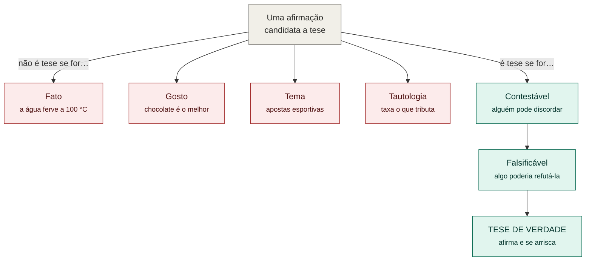

# MÉTODO — O que é uma tese e para que serve

*Arquivo de referência sobre o conceito de tese e a arte de argumentar. Explica o que
sustenta a parte "não-ficcional" do projeto — a Fundamentação em `HISTORIA.md`. Fontes
reais no fim.*

---

## 1. "Tese" tem dois sentidos (não confundir)

A palavra carrega dois significados diferentes, e misturá-los gera confusão:

- **Tese como argumento:** uma *afirmação única que você defende* — uma frase discutível
  que você se compromete a provar. É o sentido que importa para este projeto.
- **Tese como documento:** o trabalho de doutorado (no Brasil, a escadinha é
  monografia → dissertação → tese). Aqui, "tese" é o calhamaço de pesquisa original.

Este arquivo trata sobretudo do **primeiro** sentido, e explica o segundo na §4.

---

## 2. O que faz uma afirmação ser uma tese

Uma tese, no sentido de argumento, precisa ser **contestável** — alguém razoável tem que
poder discordar. Isso a separa de três coisas parecidas:

- **Fato** não é tese ("a água ferve a 100 °C") — não há o que defender.
- **Gosto** não é tese ("chocolate é o melhor sabor") — não se prova nem refuta.
- **Tema** não é tese ("apostas esportivas") — é assunto, não afirmação.

O critério da contestabilidade tem raiz na filosofia da ciência: **Karl Popper** argumentou
que uma afirmação só é científica se for *falsificável* — se existir, em princípio, uma
observação que poderia derrubá-la. Uma tese que nada poderia refutar não é forte; é vazia.

### O inimigo da tese: a tautologia

Uma **tautologia** é uma afirmação sempre verdadeira — mas verdadeira *pela própria
estrutura*, então não diz nada sobre o mundo. Exemplos:

- "Amanhã vai chover ou não vai chover." — impossível errar, e por isso inútil: não te diz
  se leva guarda-chuva.
- "Ele faliu porque ficou sem dinheiro." — ficar sem dinheiro *é* falir; a frase gira em
  falso, não explica a causa.
- "É ilegal porque a lei proíbe." — anda em círculo.

A tautologia é o inimigo natural da tese, porque **não é contestável** — ninguém discorda
do que é verdadeiro por definição. Se a sua tese pode ser reescrita como tautologia, ela
está vazia. Compare, no próprio projeto:

- *"O Estado taxa o que ele tributa."* → **tautologia** (taxar e tributar são o mesmo);
  gira em falso.
- *"O Estado não proíbe o vício por princípio, mas por cálculo fiscal."* → **tese de
  verdade**, porque alguém pode genuinamente discordar (pode ser por saúde pública, por
  demanda popular). Ela afirma e se arrisca.

### Diagrama: a estrutura dos inimigos da tese

Os quatro caminhos da esquerda (vermelho) **matam** a afirmação — ela não chega a ser
tese. Os da direita (verde) a **validam**: uma frase que é contestável e falsificável
afirma algo real e se arrisca. É o mesmo raio-X da seção anterior, agora aplicado *antes*
de escrever — para checar se você tem uma tese ou só um impostor bem-vestido.

---

## 3. A anatomia de um argumento — o modelo de Toulmin

A ferramenta clássica para construir e testar um argumento é o modelo do filósofo britânico
**Stephen Toulmin**, de *The Uses of Argument* (1958). Ele nasceu da análise de argumentos
**jurídicos** — como um advogado prova um caso — e depois se espalhou para retórica,
comunicação e redação acadêmica. Tem seis peças; as três primeiras são essenciais:

1. **Afirmação (claim):** o que você quer que o leitor aceite. É a sua tese.
2. **Base/evidência (grounds):** os fatos, dados, exemplos que sustentam a afirmação.
3. **Garantia (warrant):** a ponte lógica que liga a evidência à afirmação — Toulmin a
   definiu como o enunciado que "autoriza a passagem da base para a afirmação". Muitas
   vezes fica implícita; uma garantia forte é difícil de contestar, uma fraca derruba o
   argumento.

E as três que blindam o argumento:

4. **Apoio (backing):** justifica a própria garantia, quando ela não é óbvia.
5. **Qualificador (qualifier):** limita o alcance da afirmação com honestidade ("na
   maioria dos casos", "tende a") — em vez de fingir certeza absoluta.
6. **Refutação (rebuttal):** encara ao menos uma objeção. Sem isto, você tem um desabafo,
   não uma tese.

O modelo serve para **duas coisas**: *construir* um argumento sólido e *diagnosticar* um
argumento alheio — quando algo "soa errado", checar qual das seis peças está faltando
revela onde está o furo.

### As seis peças no mesmo argumento (exemplo)

Fica abstrato sem exemplo. Veja um único argumento — *"o Estado deveria parar de expandir
as apostas legalizadas"* — desmontado nas seis peças:

1. **Afirmação:** "O Estado deveria parar de expandir as apostas esportivas legalizadas."
2. **Evidência:** "Porque estudos mostram que a legalização aumenta a dívida e a falência
   das famílias mais pobres."
3. **Garantia (a ponte, quase sempre não dita):** "Porque o Estado não deveria promover
   algo que prejudica financeiramente seus cidadãos mais vulneráveis." — se alguém *não*
   aceitar essa ponte, o argumento inteiro cai; por isso é o elo mais frágil.
4. **Apoio (justifica a garantia):** "Proteger os vulneráveis de danos previsíveis é
   função básica do Estado, reconhecida desde as leis de proteção ao consumidor."
5. **Qualificador (limita o alcance):** "Na maioria dos casos, e sobretudo entre jovens de
   baixa renda, o dano supera o benefício." — o "na maioria dos casos" impede que uma
   única exceção derrube tudo.
6. **Refutação (encara a objeção mais forte):** "É verdade que proibir pode empurrar o
   jogo para o mercado ilegal — mas regular com limites rígidos não é o mesmo que expandir
   agressivamente, que é o que se critica aqui."

As seis peças juntas formam um argumento que se defende sozinho: cada uma tapa um buraco
por onde alguém poderia atacar.

### O uso diagnóstico (exemplo)

Agora imagine que alguém diz só: *"o Estado tem que parar com as apostas porque isso faz
mal."* Soa fraco — mas por quê? Rodando o checklist de Toulmin, o furo aparece na hora: há
afirmação e uma evidência vaga ("faz mal"), mas **falta a garantia** (por que "fazer mal"
obriga o Estado a agir?) e **falta a refutação** (e o argumento do mercado ilegal?). O
modelo mostra *exatamente* onde o argumento está oco — funciona como um raio-X.

---

## 4. A tese acadêmica (o documento) e sua função

No sentido do documento de doutorado, a tese existe para um propósito específico:
**produzir conhecimento novo.** Ela não resume o que já se sabe — adiciona algo inédito.
Suas três funções são: (1) provar que o autor é capaz de conduzir pesquisa independente;
(2) contribuir com um pedaço novo para o conhecimento da área; (3) submeter isso ao crivo
de outros especialistas (a banca). É o "passaporte" que torna alguém um pesquisador
reconhecido.

---

## 5. Para que servem teses, na prática

- **Fazer o conhecimento avançar** — a maior parte do que a ciência descobre passa por
  teses e artigos revisados por pares.
- **Formar quem pensa com rigor** — o processo de escrever uma ensina a separar o que se
  acha do que se consegue provar.
- **Embasar decisões** — políticas públicas, medicina e engenharia se apoiam em pesquisa
  acumulada.
- **Treinar a argumentação** — a mesma estrutura (afirmação + evidência + resposta às
  objeções) serve num tribunal, numa reunião, num debate ou num livro.

No fundo, a tese combate um problema humano básico: a tendência a acreditar no que é
confortável e a confundir opinião forte com verdade. Ela força o *porquê* — e exige
aguentar a pergunta "e se estiver errado?".

---

## 6. Aplicado a *O Voto Final*

O que a tese faz dentro deste livro que a ficção sozinha não faria:

- **Dá espinha intelectual.** O romance emociona (o irmão, o coveiro, o luto); a tese
  fundamenta (*por que* o mundo funciona assim). Uma sem a outra fica pela metade: ficção
  sem tese vira lamento; tese sem ficção vira panfleto.
- **Blinda contra a descrença.** Quando o leitor pensa "isso é exagero", a Fundamentação
  responde com fato (a PAM foi real; a ADI existe; os estudos mostram quem perde). A
  ficção pode voar justamente porque a base está ancorada.
- **Segue o modelo de Toulmin** (mesmo sem dizer): a Fundamentação em `HISTORIA.md` tem
  afirmação central (o Estado administra o vício por cálculo fiscal), evidência (álcool,
  maconha, apostas), garantia (a leitura marxista da dupla apropriação), qualificador (a
  forma "modificada" da tese) e refutação (a seção de contrapontos). É por isso que ela é
  uma tese, e não um desabafo.

> **Regra de ouro do projeto:** na `HISTORIA.md`, tese e ficção convivem mas não se
> contaminam — a tese precisa ser defensável (fato), a ficção precisa ser coerente
> (invenção). Ver também `MITOLOGIA.md`, que é pura invenção e por isso *não* entra na
> tese.

---

## 7. Fontes

- **Toulmin, S. (1958).** *The Uses of Argument.* Cambridge University Press. (O modelo
  claim–grounds–warrant–backing–qualifier–rebuttal.)
- **Popper, K. (1959).** *The Logic of Scientific Discovery.* (Falsificabilidade: uma
  afirmação forte é aquela que poderia, em princípio, ser refutada.)
- **Aristóteles**, *Retórica.* (A raiz antiga: ethos, pathos, logos — os modos de
  persuasão.)
- Purdue Global Writing Center — "The Toulmin Model of Argument":
  https://purdueglobalwriting.center/the-toulmin-model-of-argument/
- UTSA Writing Center — "The Toulmin Argument Model" (PDF):
  https://www.utsa.edu/twc/documents/Toulmin_Model_of_Argumentation.pdf

*Nota: as obras de Toulmin, Popper e Aristóteles são referências clássicas de base;
confirmar edição/tradução ao citar formalmente.*
