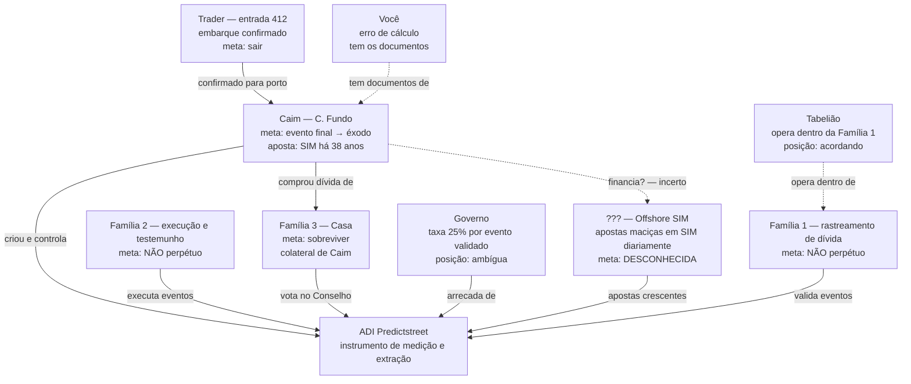

# O VOTO FINAL

> _Um mundo onde é possível apostar em tudo — inclusive no próprio fim._

> **Referência:** [PERSONAGENS.md](PERSONAGENS.md) | [FUNDAMENTOS.md](FUNDAMENTOS.md) | [DEMONSTRACAO.md](DEMONSTRACAO.md) | [investigacoes/ADI/ADI.md](investigacoes/ADI/ADI.md)

---

## ORIENTADOR DE TEMPO

Toda cena tem um selo de tempo. A regra do fuso é simples:

- **No Brasil** (onde vivem o narrador, o irmão, a mãe — e onde fica a sede da ADI que
  aparece na trama, o prédio de vidro): **horário de Brasília (BRT)**.
- **Nos EUA** (o estádio da final da Copa): **horário do leste (EDT)**, com o lugar
  indicado.

A ADI opera de forma **global**, com sedes no mundo todo; a que pesa nesta história fica no
Brasil. O **marco zero** é o **Primeiro Aviso Global** — simultâneo no mundo todo; só o
relógio local muda: 22h17 (BRT) no Brasil, 21h17 (EDT) no MetLife Stadium, em Nova York.

---

## A REGRA DO MUNDO

Todo dia, no **celular mundial** — aparelho de uso obrigatório, com CPF e carteira
mundiais —, chega uma votação. A mensagem é sempre a mesma, e o relógio recomeça todo dia:

> 🌍 **O mundo será destruído em 24 horas.**
> **SIM** — Todo mundo morre · **NÃO** — Todo mundo vive

Votar é obrigatório. Quem não vota é multado. E, como tudo que é obrigatório e move
dinheiro, a votação é **regulada e taxada pelo Estado**: cada voto é também uma aposta,
com cotação ao vivo, e o governo fica com a sua fatia.

O mundo nunca acabou. Não porque o SIM nunca assustou — assustou, e muito. Mas porque
alguém descobriu cedo que o lucro nunca esteve no fim. O lucro está no _medo diário_. O
fim é o produto que nunca precisa ser entregue.

### As categorias de notificação

Cada tipo de contrato tem um ícone fixo na tela do celular mundial — o catálogo do
mercado, onde até a morte é uma prateleira:

| Ícone | Categoria                                                    |
| ----- | ------------------------------------------------------------ |
| 🌍    | Votação Global (o fim do mundo — o alerta que todos recebem) |
| 🔴    | Votação Pessoal (notificação dirigida a um indivíduo)        |
| 💀    | Aposta de Mortalidade (apostar se alguém morre)              |
| ⚽    | Aposta Esportiva de Morte (o placar valendo uma vida)        |
| 🩸    | Cobrança / Agiotagem ("dobre agora e quite tudo")            |
| ⚖️    | Júri de Mercado (a justiça virando cotação)                  |
| ⛏️    | Mercado sobre um Indivíduo (a "pá no cifrão")                |

_Os ícones aparecem só nas telas do celular — nunca na narração corrida._

Este livro começa no **primeiro dia** em que a votação apareceu.

---

## A TESE (resumo) — _ponto 1 de 2_

**O Estado capitalista não proíbe o vício por princípio; administra-o por cálculo
fiscal.** Ele proíbe enquanto não consegue taxar e legaliza quando arrecada — até
transformar o desespero, a morte e o próprio fim do mundo em base tributável.

Esta história é a prova dessa tese, levada ao limite. A versão completa está em
**[FUNDAMENTOS.md](FUNDAMENTOS.md)**.

---

## PERSONAGENS

_Perfis completos em [PERSONAGENS.md](PERSONAGENS.md). Ninguém tem nome — todos por função,
como o sistema os vê. A marca (🩶, 🖤, ⛏️…) aparece **só na primeira entrada** de cada um._

| Marca | Personagem         | Entra em           |
| ----- | ------------------ | ------------------ |
| 🩶    | Você (o narrador)  | Cap. I             |
| 🕯️    | O irmão            | Aprof. 2.4; Cap. V |
| 🖤    | A mãe              | Cap. V             |
| ⛏️    | O coveiro          | Cap. IX            |
| 🚬    | A senhora de preto | Cap. VIII          |
| 💼    | O trader           | Aprof. 15.1        |
| 🧹    | O faxineiro        | Cap. XX            |
| 🤍    | A mulher da Casa   | Cap. XVIII         |
| 🏛️    | A Casa             | Cap. XVIII         |
| 🎲    | ADI Predictstreet  | Cap. II            |

---

## A HISTÓRIA

### PARTE I — O Primeiro Dia

#### Capítulo 1 — O Alerta

> _22h17 (BRT) — sua casa, no Brasil. No estádio, em Nova York, são 21h17 (EDT)._

A final da Copa estava empatada na prorrogação. 🩶 Você assistia pela CazéTV, sozinho na
sala, o volume baixo pra não acordar a mãe. Em Nova York, no gramado do MetLife, oitenta
mil pessoas rugiam. Aqui, era só você e o brilho da tela no escuro.

De repente, todos os celulares do estádio vibraram ao mesmo tempo — a câmera pegou a
arquibancada inteira baixando o olhar de uma vez, como um campo de trigo deitando no
vento. E não era só lá. Era o mundo. O teu celular, na mesa, acendeu junto. Um alerta
vermelho tomou todas as telas do planeta no mesmo segundo:

> 🌍 **ALERTA GLOBAL — VOTAÇÃO IMEDIATA**
> O mundo inteiro será destruído em 24 horas. Vote agora:
> **SIM** — Todo mundo morre. · **NÃO** — Todo mundo vive.

O locutor da CazéTV ficou em silêncio quase dez segundos — uma eternidade na TV ao vivo.
Quando falou, a voz falhava:

— Galera… isso tá aparecendo na tela de vocês também?

Ninguém sabia que aquele era o primeiro dia de uma coisa que nunca mais ia parar.

#### Capítulo 2 — O Caos

> _22h20 (BRT) — três minutos depois. O mundo inteiro, ao mesmo tempo._

Em menos de um minuto, tudo mudou. No estádio, gritos e choro; gente paralisada olhando
pro celular. O contador apareceu nos telões e na tua tela, atualizando ao vivo:

> 🌍 **SIM: 14% · NÃO: 86%**

O que quase ninguém entendeu é que ninguém estava votando sobre o fim do mundo. O app da
🎲 ADI Predictstreet mostrava, do lado do SIM, uma frase pequena: _"pagando mais agora."_
Gente apertava SIM no reflexo, atrás do prêmio maior, sem ler direito. Achavam que
decidiam a humanidade. Eram só liquidez.

E o mundo inteiro fazia isso ao mesmo tempo, cada um do seu jeito:

> _21h18 (EDT) — arquibancada, MetLife._ Um torcedor que economizou onze meses pra estar
> ali não olha o celular. _Depois. Depois do gol eu olho._ Nada é mais urgente que a falta
> que o camisa 10 vai bater. _(POV: Aprofundamento 2.1.)_

> _21h19 (EDT) — algumas fileiras acima._ Uma menina de sete anos, no colo do pai,
> pergunta o que é aquilo. O pai, branco, entrega o celular na mão dela: "Aperta o verde,
> filha." Ela aperta porque verde é bonito. _(POV: Aprofundamento 2.5.)_

E, mesmo assim, o jogo continuou. A bola rolou enquanto o mundo votava se merecia
existir. Ninguém apitou o fim — como se parar fosse admitir que era real.

> _Cada ponto por cento é uma pessoa. Aprofundamentos paralelos (opcionais): 2.1 a 2.5,
> no fim do livro._

#### Capítulo 3 — A Reflexão

> _22h30 (BRT) — seu quarto._

Você estava no quarto escuro, o dedo tremendo em cima do botão verde. Pensou na sua mãe,
dormindo no quarto ao lado. No seu irmão, que tinha saído de tarde e ainda não tinha
voltado — o que já não era novidade, e já era um aperto no peito. No cansaço de tudo: o
aluguel atrasado, a geladeira quase vazia, a sensação de que o mundo já era meio
insuportável mesmo sem votação nenhuma.

Por um segundo — um segundo que você ia carregar pra sempre — quase apertou SIM.

Apertou NÃO.

Depois deitou, e ficou olhando o teto, esperando a chave girar na porta. Ela não girou.

#### Capítulo 4 — O Resultado

> _00h01 (BRT) — a votação fecha._

O contador parou:

> 🌍 **SIM: 11,4% · NÃO: 88,6%**

Nada aconteceu. O céu não abriu. Nenhum míssil. Em Nova York o jogo seguiu, a prorrogação
terminou, o time campeão levantou a taça sob confete e fogos.

E num servidor da ADI Predictstreet, uma linha se fechou no balanço: aquela votação tinha
movimentado mais dinheiro em apostas do que qualquer evento da história. Ninguém morreu no
palco global. Alguém ficou muito mais rico.

Ninguém percebeu, naquela noite, que o mundo não tinha escolhido _viver_. Tinha só
descoberto que dava pra apostar na própria morte — e que isso pagava bem.

#### Capítulo 5 — A Bala

> _02h14 (BRT) — quatro horas depois do Aviso._

Enquanto oito bilhões de pessoas apertavam botões achando que decidiam o mundo, a mesma
plataforma rodava, por baixo, um produto menor e mais antigo: apostas de bairro "valendo a
vida". Partidas de várzea onde o placar valia sangue. 🕯️ Seu irmão estava numa delas,
afundado numa dívida com um agiota, e perdeu.

Ele estacionava o carro na frente de casa quando o outro se aproximou pela calçada. Não
houve discussão, não houve ódio. Um tiro, frio, na cabeça — como quem aperta _enter_ pra
liquidar uma posição. O atirador não conhecia seu irmão. Estava só _executando a odd_.

Às 02h14, o celular tocou. Era a sua mãe — que tinha descido, que tinha visto. Você
atendeu já sabendo, porque ninguém liga a essa hora pra dar boa notícia. A voz dela veio
destruída, sem forma:

— Filho… desce. Desce, filho, pelo amor de Deus…

Ela não conseguiu dizer o resto. O jeito que ela respirava disse.

> _O tiro não teve raiva: teve preço. O capital não matou por maldade — só fechou uma
> posição. A morte foi o custo da operação. (Ver [FUNDAMENTOS.md](FUNDAMENTOS.md), ponto
> 4, e a nota sobre "gerenciar risco".)_

---

### PARTE II — O Luto

#### Capítulo 6 — A Fronteira Infinita

> _Madrugada, 04h40 (BRT) — a casa, depois que levaram o corpo._

Você não dorme. Anda pela casa como bicho enjaulado, evitando o corredor onde ainda tem
uma mancha que a chuva não lavou. Abre o feed no automático, só pra não ficar com a própria
cabeça — e lá está, entre uma propaganda de aposta e outra: um homem, do outro lado do
mundo, acabou de se tornar o primeiro trilionário da história. Foguetes. Marte. "Tornar a
humanidade multiplanetária."

Você olha pro teto rachado e ri, seco, uma risada sem graça nenhuma.

— Multiplanetária — repete pra parede. — Vão levar essa merda pra Marte também.

Porque é isso que você entende agora, cinco da manhã, sem irmão: o dinheiro não tem chão
nem teto. Sugou a fábrica, o salário, o vício, a dívida — e quando acabar a Terra, vai
sugar Marte. Alguém vai erguer uma cidade vermelha a cinquenta milhões de quilômetros só
pra ter mais gente pra explorar, mais aposta pra taxar. Mais liquidez.

Teu irmão morreu por mil reais. Lá em cima, um cara ganhou um trilhão dormindo. É o mesmo
motor. Só muda o andar.

#### Capítulo 7 — O Cálculo

> _Tarde, 15h20 (BRT) — dois dias depois. Seu quarto._

A mãe botou o celular do seu irmão na tua cama antes de sair pro velório. A polícia tinha
ficado dois dias com as coisas dele. Devolveu tudo numa sacolinha de plástico: chave do
carro, carteira sem nada, fone com o cabo torto. E o celular.

A tela desbloqueou sozinha — devia ter ficado logada. App da ADI Predictstreet aberto, na
última sessão. E você viu.

Ele tinha apostado tudo que devia ao agiota no SIM do fim do mundo. A odd era alta porque
quase ninguém acreditava: se desse SIM, quitava tudo de uma vez, num clique. Não deu. A
dívida rolou pra semana seguinte — e o que ele apostou entrou na piscina da plataforma,
virou liquidez, circulou pelas apostas menores que rolavam por baixo. O dinheiro dele
entrou no prêmio que pagou a própria bala. A máquina fechou a conta dele com o dinheiro
dele.

Você fecha o app. E, sem querer, abre o de votação obrigatória. A notificação dele ainda
está lá:

> ⚠️ 🌍 **VOTO PENDENTE — HOJE.** Este usuário não votou. Multa em andamento.

O sistema ainda não sabe que ele morreu. Pra ele, seu irmão está só atrasado.

Explorado no trabalho. Explorado no desespero. Taxado na morte. E agora multado porque um
defunto não votou no fim do mundo. A mesma pessoa — e o sistema ainda está cobrando.

E aí a ficha cai, fria: aquela votação global da noite da Copa não era sobre o mundo. Era
liquidez pra precificar o jogo de várzea onde apostaram a vida dele. Cada SIM que os outros
apertaram atrás de prêmio ajudou a mover a odd que pagou a bala. Todo mundo achando que
decidia a humanidade. Ninguém sabendo que decidia _ele_.

#### Capítulo 8 — O Velório

> _19h00 (BRT) — capela do bairro._

A capela abafada, pequena demais pra tanta gente. Cheiro de vela barata, suor, café ralo e
cigarro na porta. Teu irmão num caixão barato, o rosto inchado, o buraco tampado com
maquiagem pior ainda. Você encostado na parede, um ódio seco sem lágrima, ouvindo o bairro
inteiro passar.

E o bairro fala. Sempre fala. Aos pedaços, por cima do caixão:

— Tão dizendo que foi dívida de aposta…
— Mil reais, ouvi falar. Mil reais.
— A mãe, coitada. Terceiro filho que ela enterra desse jeito na rua.
— Não era só ela. Semana passada foi o menino da esquina. Mesma coisa.

Num canto, duas comadres com o celular na mão. Uma cutuca a outra, e você ouve, porque elas
não sabem falar baixo:

— Olha aqui, ó. O cara que ganhou a aposta dele já postou. Levou quarenta e sete mil. Mil
de entrada e o resto na multiplicação…
— Deixa eu ver a cotação de hoje…

🚬 A senhora de preto — que já enterrou meio bairro, que fuma na porta de todo velório desde
antes de você nascer — atravessou a capela devagar. Não gritou. Pôs a mão em cima do
celular da comadre e abaixou ele com delicadeza, do jeito de quem já fez isso muitas vezes:

— Guarda isso, minha filha. — A voz rouca, sem raiva. — Não é pra respeitar o morto, não.
É pra você. Um dia o número nessa tela vai ter o nome de um filho seu, e não vai ter
ninguém pra abaixar o teu telefone. — Ela olhou o caixão. — A gente é tudo cotação de
alguém, esperando a vez. Aproveita enquanto ainda dá pra chorar de graça.

A comadre guardou o celular, vermelha. O silêncio caiu pesado por um instante — e depois o
murmúrio do bairro voltou, porque a vida no bairro nunca para de murmurar. Você quase
sorriu. Pela primeira vez em dois dias, alguém tinha dito uma coisa verdadeira.

#### Capítulo 9 — O Coveiro

> _10h00 (BRT) — dia seguinte, cemitério._

Quando o caixão começou a descer, ⛏️ o coveiro parou o serviço um segundo. Magro, pele
queimada de sol. Olhou pro corpo lá dentro e falou alto, quase debochando — mas não era
deboche, você entenderia depois. Era cansaço virado do avesso:

— Já era, rapaz. Você tá morto.

Cuspiu no chão e continuou, mais baixo, carregado:

— Se eu pudesse te perguntar antes de jogar a terra… você queria continuar vivo por mil
reais? Só isso. Aceitava? Porque foi isso que apostaram contra você. Mil reais pra você
virar defunto.

Encaixou a pá na terra.

— Eu enterro três, quatro por semana por causa dessa mesma merda. Governo feliz, empresa
feliz, o vencedor da aposta feliz. E o morto sou eu que enterro. Todo mundo cobra a parte
dele nesse menino. Menos eu. Eu só cubro.

#### Capítulo 10 — A Nota Fiscal

> _11h30 (BRT) — funerária, na saída do cemitério._

Na funerária, a mulher atrás do balcão — cara de quem já viu de tudo — empurrou o papel:

— Total: quatro mil oitocentos e setenta. Tem o imposto de doze por cento sobre serviço
funerário. Novo, desde a lei das apostas.

Você olhou sem acreditar.

— Meu irmão foi morto por uma aposta de mil reais e vocês cobram imposto pra enterrar ele?

Ela deu de ombros, sem emoção nenhuma:

— É a lei. Morte por dívida de jogo entrou numa categoria nova. O governo quer a parte
dele. Quem ganhou a aposta também declara o lucro e paga imposto sobre isso. Tá tudo
certinho, tá tudo registrado.

Você bateu a mão no balcão.

— Então o filho da puta que ganhou apostando na morte dele paga imposto sobre o sangue. E
vocês cobram imposto pra enterrar. Todo mundo fatura no meu irmão, menos meu irmão.

Ela só baixou os olhos.

— Eu só trabalho aqui, moço.

#### Capítulo 11 — O Adeus

> _12h00 (BRT) — de volta ao cemitério, antes de fechar a cova._

Você voltou ao caixão antes de fecharem de vez. Encostou a testa na madeira fria e falou
baixo, só pra ele:

— Legalizaram tudo, mano. O vício. A dívida. Apostar contra a tua vida. E agora taxam até
a tua morte.

E veio o pensamento que você tinha medo de pensar:

— Eu votei NÃO naquela noite. E se eu tivesse votado SIM? Se o mundo tivesse acabado
naquela madrugada, você não teria saído de casa… você ainda tava aqui…

A mão da sua mãe pousou no teu ombro. Firme. Ela tinha ouvido tudo.

— Olha pra mim. — A voz veio rouca, mas não tremeu. — Você apertou um botão pra salvar o
mundo, filho. Foi isso que você fez. Não foi você que puxou gatilho. A culpa desse tiro tem
endereço, tem nome, tem assinatura, tem CNPJ. E nenhum deles é o seu. Não carrega o que não
é teu, senão eles ganham duas vezes.

Você fechou os olhos. E, pela primeira vez desde a bala, o ódio parou de apontar pra dentro
e encontrou a direção certa: pra fora, pra cima, pro vidro.

O coveiro jogou a primeira pá de terra. Seco. Definitivo.

---

### PARTE III — A Rotina

#### Capítulo 12 — Todo Dia

> _Manhãs seguintes — semanas se somando._

O primeiro dia virou todo dia. A votação não foi embora — virou hábito. Toda manhã, o
celular mundial apita:

> 🌍 **O mundo será destruído em 24 horas.** SIM morre · NÃO vive. Voto obrigatório. Multa em 2h.

As pessoas votam entre o café e o ônibus, do mesmo jeito que pagam boleto. O fim do mundo
virou conta mensal.

E, como toda conta, é taxada. O Estado fica com a fatia de cada aposta diária no
apocalipse. Ninguém pergunta mais por que o mundo ainda existe. A resposta, ninguém quer
encarar: porque o fim nunca foi o produto. O medo é. E medo, cobrado todo dia de oito
bilhões de pessoas, não tem preço — tem mensalidade.

#### Capítulo 13 — A Recusa

> _03h00 (BRT) — seu quarto, uma noite qualquer._

Você jurou que não ia mais jogar. E cumpriu — mas o mercado não desiste fácil.

Naquela noite, o celular acendeu sozinho, com fonte vermelha mais escura que a de sempre:

> 🔴 **VOTAÇÃO PESSOAL**
> Você aceita que a morte do seu irmão foi apenas mais um evento de mercado legalizado?
> **SIM** → Continua no jogo. · **NÃO** → Rejeita para sempre.

Uma votação só pra você. Você olhou aquilo por um tempo, entendendo o tamanho do que
significava: alguém, em algum lugar, tinha te endereçado.

Você podia se acabar. Seria fácil — seria até o que o sistema espera, porque você sabe que
amanhã já vai ter gente apostando nisso: se você aguenta, se é o próximo a custar mil
reais. E é exatamente por isso que você não vai.

Digitou **NÃO** — não pela votação, mas pela vida inteira que vinha depois dela. Você ia
fazer a única coisa que um mercado não sabe taxar: contar. Falar o que aconteceu até virar
barulho. Barulho não tem cotação.

#### Capítulo 14 — O Nome

> _Ainda naquela noite._

O nome dele era **\_\_\_\_**.

Você percebe, de repente, que ninguém — em momento nenhum, nem a polícia, nem a funerária,
nem a comadre com o celular — disse o nome dele. Ele virou "a vítima". Virou "evento de
mercado". Virou "o caso". Virou "mais um".

Você abre a boca no quarto vazio e diz o nome. Alto. De novo. E mais uma vez, até a voz
falhar.

E, pela primeira vez em dias, o silêncio no quarto não pertence ao mercado. Pertence a
você.

---

### PARTE IV — O Júri de Mercado

#### Capítulo 15 — O Júri de Mercado

> _Dias depois — no seu celular, à noite (BRT). A ordem final vem de uma sala de vidro, na sede da Casa — 21h04 (BRT)._

O celular acende com um selo novo: um martelo de juiz dentro de um cifrão.

> ⚖️ **JULGAMENTO ABERTO — CASO #4471-B**
> Réu: o vencedor da aposta que resultou na morte de um devedor (mil reais).
> A comunidade decide. Vote e posicione-se:
> **CULPADO** → prisão. · **INOCENTE** → liberado.
> _Cotação ao vivo. Resultado por maioria ponderada._

Você lê "maioria ponderada" três vezes até entender: não é um voto por cabeça. É um voto
por real. Quem coloca mais dinheiro de um lado, pesa mais.

A justiça do seu irmão vira um número que sobe e desce como ação na bolsa. Sem juiz, sem
lei. Só liquidez. E o mercado te oferece o que você mais quer: um botão verde, _"Reforce
CULPADO. Ajude a fazer justiça. A partir de R$ 50."_

Você tem cento e vinte no app. Podia. _Quer._ O polegar treme sobre o botão — o mesmo
tremor do botão verde da noite da Copa.

E então entende a armadilha: se apostar na condenação, seu irmão vira aposta de novo. A
morte dele vira cotação outra vez, agora na sua mão. A justiça é só a isca. O mercado não
quer sua justiça — quer seu dinheiro dentro dele.

Você tira o dedo do botão.

CULPADO chega a 68%. Você quase acredita. Aí, às 21h04, entra uma ordem enorme — uma só, de
uma sala de vidro do outro lado da cidade — e o número despenca. 68, 59, 44, 31. INOCENTE
passa na frente e trava.

> ⚖️ **VEREDITO: INOCENTE (por maioria ponderada). Réu liberado.**

O assassino do seu irmão está livre. Não por ser inocente. Porque alguém com mais dinheiro
apostou que ele saísse — e lucrou. Você não apostou. Manteve a palavra. E não mudou nada. O
mercado não pune quem se recusa a jogar; só segue sem você.

Mas tem uma coisa que a ordem das 21h04 não comprou: você sabe o nome do seu irmão. E o
mercado, não. Pra ele, o caso #4471-B fechou no lucro. Pra você, tem rosto. Barulho não tem
cotação — você repete baixinho, feito reza. A única coisa que ninguém consegue apostar
contra.

> _Aprofundamentos paralelos (opcionais): 15.1 — o outro lado, quem lucra; 15.2 — como a
> ameaça vira mercado. No fim do livro; a história segue direto na Parte V._

---

> _Fim da Parte IV._

---

### PARTE V — O Barulho

#### Capítulo 16 — Contar

> _Semanas depois — o bairro, de dia; o sinal chega às 03h02 (BRT)._

Você não tinha um plano. Tinha uma promessa: contar. Só que num mundo onde tudo vira
cotação, você aprendeu rápido que post não serve. Você escreveu um, na primeira noite — o
nome do seu irmão, o que fizeram com ele, os mil reais. Em quarenta minutos tinha virado
número: curtidas, compartilhamentos, e do lado, discreta, uma caixa que já perguntava
_"quantas pessoas vão compartilhar isto até amanhã? Aposte."_ O algoritmo não te silenciou.
Fez pior: te transformou em aposta. Você apagou.

Então você fez a única coisa velha o bastante pra não ter cotação. Você foi falar com
gente. Cara a cara.

Começou onde a morte é honesta: no velório de um desconhecido. Outro rapaz, outra dívida,
outra bala. Você entrou, sentou no fundo, e quando a mãe do menino passou perto, você disse
baixo: "o meu também." Só isso. E ela parou. Porque "o meu também" é uma frase que nenhum
aplicativo sabe fabricar.

Você contou. O nome do seu irmão. A partida de várzea. A odd. O tiro frio. E, na porta,
encostado, o coveiro — o mesmo, magro, pele de sol — ouvindo. Quando você terminou, ele
cuspiu no chão do jeito dele e falou:

— Tá vendo? É isso que eu não consigo enterrar. O nome. A terra cobre o corpo, moleque, mas
não cobre o nome. Você achou a única pá que eles não têm.

Naquela semana você foi a mais quatro velórios. Não pra chorar — pra _contar_. E as pessoas
começaram a repetir. Uma mãe contava pra outra. Um irmão pra um primo. Sem tela, sem
número, sem lucro. Barulho de boca em boca, o tipo que não deixa rastro pra precificar. Pela
primeira vez desde a bala, você sentiu que estava tirando alguma coisa deles, em vez de
alimentar.

Foi aí que chegou o sinal.

Três e dois da manhã. O celular acendeu sozinho. Não era votação. Não era o vermelho de
sempre. Era uma tela nova, limpa, quase elegante, com um único selo no topo — uma pá dentro
de um cifrão — e uma linha que parou teu coração:

> ⛏️ **NOVO MERCADO ABERTO.** Quanto tempo até este indivíduo parar de falar?
> Cotação ao vivo.

Sem o teu nome. Só _"este indivíduo"_. Mas você soube. O jeito que a tela te encontrou às
três da manhã, sozinho, depois de uma semana contando — não era algoritmo cego. Era alguém.
Alguém tinha olhado pra você, individualmente, e feito a única coisa que aquele mundo sabe
fazer com uma ameaça: abrir uma aposta sobre ela.

Você podia dizer que era coincidência. Dava pra acreditar nisso — se você quisesse dormir.

Mas olhou pro selo da pá no cifrão e entendeu, com um frio na nuca, que a promessa tinha
funcionado. Você virou barulho. E barulho alto o bastante, nesse mundo, não é ignorado.

É cotado.

#### Capítulo 17 — A Odd Contra Você

> _Dia seguinte — o bairro; a virada da tela, à noite._

Você passou o dia seguinte olhando aquela tela sem conseguir comer. _Quanto tempo até este
indivíduo parar de falar?_ O número subia e descia sozinho, como se gente que você nunca viu
estivesse apostando na sua boca. E provavelmente estava.

O medo era o óbvio: parar. Se você calasse, a aposta "ele para" pagava, alguém lucrava, e
você continuava vivo. O mundo até facilitava — bastava o silêncio, e a máquina te deixava em
paz, do jeito que deixa todo mundo que desiste. Era o caminho de menor dor. Era exatamente
por isso que era uma armadilha.

Porque você entendeu, olhando a cotação subir, uma coisa que o mercado não previu que você
entenderia: **a aposta contra você só existe porque você importa.** Eles não abrem mercado
sobre quem é inofensivo. A pá no cifrão não era uma ameaça — era uma confissão. Você tinha
assustado alguém o bastante pra virar risco. E risco, no mundo deles, se precifica porque
não se controla.

Então você fez a coisa que quebra a conta.

Você foi ao próximo velório e contou mais alto. Contou o nome do irmão, e contou também da
tela. Da pá no cifrão. "Abriram uma aposta pra saber quando eu calo", você disse pra sala
cheia. "Quer dizer que falar funciona. Se não funcionasse, não valia aposta." E a sala, que
sabia tudo sobre apostas porque cada um ali tinha enterrado alguém por uma, entendeu na
hora. Um velho levantou e disse: "então fala pra mim também." Depois outro. Depois uma
mulher pegou seu telefone e digitou o nome do seu irmão num caderno — num caderno, de papel,
onde nenhuma odd alcança.

O nome começou a andar por onde não havia sinal. Mercearia. Ponto de ônibus. Fila de posto
de saúde. Boca, ouvido, papel. E a cada pessoa que repetia, a tua tela fazia uma coisa
estranha, quase bonita de tão sinistra: a cotação _"ele vai parar"_ despencava. Não porque o
mercado torcia por você. Porque o mercado é honesto de um jeito cruel — ele lê a realidade e
precifica. E a realidade era que você não ia parar.

Naquela noite a tela mudou de novo. O selo da pá sumiu. No lugar, apareceu uma frase que não
era votação, não era cotação, não era propaganda. Era outra coisa — mais velha, quase
educada, do tipo que não vem de algoritmo nenhum:

> **Você chamou atenção. Alguém gostaria de conversar.**

Sem preço. Sem SIM ou NÃO. Sem verde nem vermelho. Pela primeira vez desde a noite da Copa,
o celular te ofereceu não uma aposta — um **convite**. E isso, você sentiu no estômago, era
muito pior. Uma aposta você sabia recusar. Um convite feito por quem nunca precisa convidar
ninguém era uma porta se abrindo num lugar onde você não sabia que havia porta.

Você olhou o nome do seu irmão, escrito no caderno da mulher, seguro no colo dela do outro
lado da sala.

E, pela primeira vez, teve medo não do que podiam fazer com você — mas do que havia do
outro lado daquele convite.

---

> _Fim da Parte V. Continua._

---

### PARTE VI — A Casa

#### Capítulo 18 — A Conversa

> _Três dias depois — sua rua, fim de tarde; depois, um andar alto de vidro (BRT)._

O convite não disse onde nem quando. Não precisou. Três dias depois, um carro que não fazia
barulho parou na tua rua — desses caros demais pra existir ali —, e o homem ao volante só
abriu a porta de trás e esperou. Você podia ter corrido. Mas quem foge de um convite ainda
está no jogo; quem entra, pelo menos, vê a cara de quem joga. Você entrou.

Não te levaram a um bunker de filme. Te levaram a um andar alto, de vidro, silencioso, o
tipo de lugar onde o mundo lá embaixo vira maquete.

🤍 Uma mulher te esperava — terno claro, voz macia, a calma de quem nunca na vida precisou
levantar a voz porque nunca na vida alguém disse não pra ela. Ela te ofereceu água. Você não
bebeu.

— Você tem incomodado — ela disse, sem raiva, quase com carinho. — Não a nós. Nós não nos
incomodamos. Você tem incomodado _o preço_. Toda vez que alguém repete o nome do seu irmão
sem pagar por isso, um número, em algum lugar, não fecha. E números que não fecham são a
única coisa que nos tira o sono.

Você perguntou quem era "nós". Ela sorriu como quem já ouviu essa pergunta mil vezes.

— Gente que existe antes de você acordar e depois de você dormir. Chame do que quiser. As
pessoas gostam de dar nome. Máfia, mercado, governo, família. — Ela deu de ombros. — No
fim, é tudo a mesma 🏛️ Casa. A gente só administra o que sobra.

Foi a palavra — _Casa_ — dita com a maiúscula ouvível, que te deu o frio na nuca. Não soou a
empresa. Soou a algo com idade. Mas você não podia ter certeza, e ela sabia que você não
podia, e essa dúvida era parte do que ela estava te oferecendo: o conforto de achar que era
só gente rica.

#### Capítulo 19 — A Oferta

> _Ainda no vidro._

Ela não ameaçou. Gente assim não ameaça — ameaça é pra quem ainda precisa convencer. Ela
ofereceu. Mas antes de falar, ficou um segundo te estudando — com a calma de quem já fez esse
cálculo mil vezes e nunca errou.

— Todo mundo tem um preço — ela disse, sem ironia, quase com carinho. — O seu é bonito. Você
não quer dinheiro. Quer que não tenha sido à toa.

O caso do seu irmão, reaberto. O tribunal que o absolveu, recomposto com juízes que saberiam
para que lado o peso vai. Veredito diferente. Nome diferente. A mãe nunca vê uma conta pelo
resto da vida. E o nome do seu irmão numa placa, numa rua, numa lei que tornaria ilegal o
tipo de aposta que o matou. Sentido. O tipo que você passou meses procurando e não encontrou
em lugar nenhum porque não existe à venda no mercado comum.

— A gente fabrica sentido — ela disse, sem modéstia. — É o que fazemos. Melhor do que
qualquer coisa que você vai construir sozinho em velório de gente pobre.

Você ficou quieto. E enquanto ficava quieto, você trabalhou o mecanismo por dentro —
porque ela tinha nomeado certo, e isso era o pior. O preço bonito é o mais perigoso:
quando alguém te oferece exatamente o que você quer, é porque já sabe quanto você custa.
O que ela estava fazendo era comprar o barulho de volta. Não com dinheiro — com o único
produto que você não conseguia recusar: a morte do irmão transformada em coisa que não foi
à toa.

Mas você entendeu, com o mesmo frio de entender uma conta fechando, que aceitar era
transformar o irmão em produto outra vez. A morte dele pagando a sua paz. A máquina fechando
a conta dele — de novo — com o dinheiro dele.

— Não — você disse.

Ela não demonstrou surpresa. Dobrou o guardanapo com cuidado.

— Já compramos o depois — ela disse, e levantou.

O homem abriu a porta de saída. O carro estava esperando.

No caminho de volta, a frase dela ficou girando, aquela que não era ameaça nem oferta e por
isso era a mais assustadora: _já compramos o depois_. Depois do quê? Você não sabia. Mas
soube, com uma certeza fria que não vinha de prova nenhuma, que a votação diária, o medo, as
apostas — nada daquilo era caos. Era conta. E alguém, muito acima do vidro, já sabia o número
em que ela fechava.

Você chegou em casa, pegou o caderno e escreveu, embaixo do nome do seu irmão, a primeira
coisa que não era luto: _eles compraram o depois. Descobrir o quê._

---

> _Fim da Parte VI. Continua._

---

### PARTE VII — O Fio

#### Capítulo 20 — Quem Aposta no Fim

> _Semanas de investigação — o bairro e, de longe, o prédio de vidro._

Você voltou pra casa e começou a investigar.

Não de uma vez — de milímetro em milímetro, do jeito que a gente investiga quando não tem
dinheiro pra advogado nem acesso a nenhum servidor. Você foi atrás do que estava à vista e
que ninguém olhou porque era banal demais: quem aposta no SIM.

A votação era pública. Os volumes, agregados por região, apareciam no próprio app —
marketing de transparência. Você copiou os números num caderno, dia a dia, semana a semana.
E viu o padrão.

Todos os dias, apostas gigantes no SIM. Contas offshore, volumes que nenhum apostador
compulsivo tem, ordens colocadas poucas horas antes da janela fechar. E todas perdendo.
Sempre perdendo — o mundo nunca acabava. Ninguém perde dinheiro assim todos os dias por
acidente.

🧹 O faxineiro foi quem confirmou o que você suspeitava. Limpava os andares altos do prédio
de vidro há sete anos — os mesmos andares que a mulher de terno claro ocupava. A Casa esquece
que os invisíveis têm olhos. Ele trouxe papéis que tinham ficado sobre a mesa de alguém que
nunca aprendeu a ser cuidadoso com quem passa despercebido.

Os documentos eram internos. Não eram contratos de aposta — eram contratos de _estrutura_.
Alguém estava construindo algo que precisava de liquidez permanente, de mercados que nunca
fechavam, de uma base de apostadores que nunca parava de jogar. O SIM, lendo os documentos,
não era pra ganhar. Era pra manter o jogo vivo.

Você entendeu a metade. A outra metade veio depois.

#### Capítulo 21 — A Conta que Fecha ao Contrário

> _Madrugada — seu quarto, o caderno._

Você trabalhou os números durante três dias. Não dormiu direito. Comeu o que tinha.

A conta era simples quando você parava de procurar o que queria encontrar e começava a ler o
que estava lá.

Apostar alto no SIM e perder devolve vinte por cento da aposta via programa de fidelidade.
Quando muita gente desesperada aposta SIM junto — puxada pelo medo, pelas dívidas, pelo fim
do mundo que parecia sempre na iminência —, a fatia da Casa sobre o volume total subia. De
vinte por cento pra cinquenta, de cinquenta pra setenta, de setenta pra oitenta.

A verdade era que **não queriam que o SIM ganhasse.** Queriam que ele quase ganhasse, todo
dia, pra sempre. O medo não era a ameaça — era a mina. As pessoas não eram as vítimas — eram
o minério. O fim do mundo era o produto que nunca precisava ser entregue porque o valor
estava no medo de que ele chegasse.

Você escreveu no caderno, com letra de quem está garantindo que vai lembrar: _eles não
querem que o SIM ganhe. Querem que ele quase ganhe, todo dia, pra sempre._

Era a Regra do Mundo por dentro. Não era diferente do que você já sabia — era a mesma coisa,
mas agora você via a maquinaria, não só o resultado. E ver a maquinaria muda alguma coisa.
Você não podia provar nada num tribunal — a conta era de lógica, não de documento. Mas não
era um tribunal que você estava montando.

> _(A matemática completa desta conta está em [CALCULO-MARXISTA.md](CALCULO-MARXISTA.md).)_

#### Capítulo 22 — O Depois Tem Endereço

> _Dias depois — o prédio de vidro, visto de baixo._

O faxineiro voltou uma segunda vez, duas semanas depois. Desta vez sem papel — com um drive.

Os arquivos eram contratos de uma empresa que você nunca ouviu falar, subsidiária de uma
subsidiária de algo registrado em três países que não falavam entre si. Mas os contratos
tinham especificações: logística de longa distância, propulsão, sistemas de suporte à vida de
longa duração. Você não entendia metade dos termos técnicos. Mas entendia o suficiente.

Não estavam construindo um bunker. Não era uma ilha. Não era uma fortaleza num lugar remoto
desse planeta.

Era uma saída. Do planeta inteiro.

Você ficou na janela do seu quarto por um tempo que não soube medir. O teto rachado de quando
a Copa passou na TV. O celular do irmão, que a mãe guardara numa gaveta que ninguém abria. A
tela da votação piscando no canto, a mensagem de sempre: _o mundo será destruído em 24
horas._

E você entendeu, com a clareza de quem finalmente leu a conta inteira, a pergunta que
importava de verdade — não a da tela, mas a que estava embaixo dela, a que movia todo o
resto:

_O que acontece com o resto de nós quando a saída deles ficar pronta?_

Você olhou pela janela e, pela primeira vez, o medo não era do celular. Era do dia em que ele
fosse parar de apitar. Porque um mundo onde a Casa não precisa mais do teu medo é um mundo
onde a Casa não precisa mais de você.

---

> _Fim da Parte VII. Continua._

---

### PARTE VIII — O Porto

#### Capítulo 23 — O Conselho

> _Semanas depois — seu quarto, noite._

O faxineiro não voltou por quatro semanas. Você foi ao endereço do prédio dele duas vezes
— só pra verificar se o sinal não tinha sumido de vez. Estava tudo no lugar. Mas não havia
movimento. Você voltou.

Na quinta semana, ele apareceu à sua porta às onze da noite. Não bateu — ficou parado no
corredor até você sentir e abrir.

Entrou, deu uma olhada rápida no quarto, largou uma folha em cima da mesa e ficou de pé.
Uma folha só.

Era uma lista. Três colunas: nome, empresa de fachada, função no conselho. Doze entradas.
Três famílias de quatro nomes cada. As empresas eram legíveis: logística, segurança
patrimonial, consultoria de risco. O tipo de empresa que existe em qualquer junta comercial
e nunca tem um cliente que você consiga nomear.

A décima terceira entrada não tinha quatro linhas. Tinha uma.

_C. Fundo — representação permanente — presença dispensada por protocolo interno._

Você olhou pro faxineiro.

— Quem é esse?

Ele ficou quieto por tempo demais.

— A cadeira existe — ele disse. — Fica vazia toda semana. O outro representante da família
vota pelos dois.

— Quem é o outro representante?

Ele olhou pro corredor.

— A mulher — ele disse. E saiu.

Você ficou com a folha na mão. A mulher da Casa não era a cabeça — era a voz de quem nunca
precisava aparecer. C. Fundo. Uma letra e um sobrenome que não apontavam pra nenhuma pessoa
em nenhum registro.

Três famílias. Doze nomes. E um assento vazio que todo mundo sabia não estava vazio.

---

#### Capítulo 24 — O Apostador Mais Antigo

> _Doze dias depois — seu quarto, madrugada._

O faxineiro voltou. Desta vez entrou e se sentou na beira da cama — a cama que havia sido do
seu irmão. Não disse nada enquanto você abria o envelope.

Fotocópias de um livro-caixa. Posições abertas em SIM, de longo prazo. Datas, valores, notas
de renovação anual. A maioria dos últimos cinco anos — contas offshore, volumes de fundo
institucional.

Você foi descendo a lista pelo critério mais simples: data de abertura.

A posição mais antiga ficava no final da última página. A nota de transferência dizia que havia
sido aberta trinta e oito anos antes — num sistema privado, analógico, antes da ADI existir
como empresa, antes de qualquer celular mundial. Transferida por cláusula de continuidade
automática quando a plataforma surgiu.

Nome: _C. Fundo._

E abaixo, numa caixa separada:

_Instrução de liquidação: executar no evento final. Transferir ao porto._

Porto. Não a uma conta. Não a um banco. Você leu de novo três vezes pra ter certeza que era
isso que dizia.

— Você sabe o que é o porto? — você perguntou.

O faxineiro continuou olhando pro chão.

— Sei que existe um lugar na costa — ele disse. — Sei que tem construção há anos. Que o
material que entra lá não é de obra comum.

— O que é?

— O tipo que vai mais longe do que construção — ele disse.

Você colocou as fotocópias de volta no envelope. Ele levantou. Parou na porta.

— Não vou conseguir mais nada — ele disse. — Esse foi o limite.

Você olhou pra ele.

— Fica aqui com isso — ele disse. E foi embora.

Você ficou com a posição aberta há trinta e oito anos. A mais velha aposta no fim do mundo
que existia. E o relógio dela ainda estava correndo.

---

#### Capítulo 25 — O Porto

> _A mesma noite, antes do amanhecer._

Você não dormiu. Abriu o drive de novo. Pasta doze.

Topografia costeira. Coordenadas que você copiou no caderno, comparando com o que conhecia de
mapa. Uma região remota — fora de qualquer rota comercial, fora de qualquer mapa turístico.
As marcações numeradas ao longo da orla não eram pontos de acesso.

Eram pontos de saída.

Pasta treze. Listas.

Categorias: _biomédico, estrutural, logístico, pessoal._ A última era a mais longa.

Oitocentos e quarenta e sete nomes.

Você foi procurando referências. Na entrada 412 havia uma nota: _"posição de hedge encerrada,
evento 4471-B, confirmado para embarque."_ O trader. Estava na lista.

Você desceu até o fim. As últimas entradas eram só função e código. E no fundo, fora da ordem
numérica, uma entrada diferente de todas:

_0001 — C.F. — fundador._

Abaixo da lista havia uma anotação à mão. Tinta de caneta-tinteiro, traço de alguém que escrevia
antes de a folha impressa ao redor existir.

_Revisado e aprovado — Caim._

Você ficou parado.

Oitocentos e quarenta e sete nomes na lista das pessoas que iam sobrar. E antes do número um,
a assinatura de quem aprovou a lista inteira. Não havia título. Não havia cargo. Não havia
sobrenome.

Só _Caim_.

Você fechou o drive e olhou pro celular. A votação do dia ainda estava aberta — o mundo a ser
destruído em 24 horas, SIM ou NÃO, como todo dia.

Pela primeira vez, você entendeu o que o NÃO protegia.

Não a humanidade. A lista.

Enquanto o mundo votava NÃO com medo de morrer, oitocentos e quarenta e sete nomes esperavam.
Um porto na costa esperava. E Caim esperava com eles — há trinta e oito anos, a aposta mais velha
e mais paciente do mundo.

O NÃO os mantinha ricos. O SIM os tornava livres.

E o mundo, com medo de acabar, não deixava nem uma coisa nem outra acontecer.

---

> _Fim da Parte VIII. Continua._

---

### PARTE IX — A Caça

#### Capítulo 26 — O Faxineiro Não Voltou

> _Três semanas depois — fim de tarde (BRT)._

Três semanas. Onze vezes que você chegou no prédio da limpeza da cidade e o posto dele estava
com outro funcionário. Na terceira semana você perguntou diretamente.

— Pediu demissão. Não deixou endereço.

Você foi ao cartório. Nome, CPF que você tinha anotado no caderno uma vez sem saber que ia
precisar. Nenhum registro de mudança de endereço. Nenhum contrato novo.

Puxou as contas de utilidade pelo número do apartamento. Energia, água: última leitura havia
dezoito dias. Cortadas por falta de pagamento.

Você foi até o conjunto popular na zona norte. Quatro andares, sem elevador. Porta do 3B
trancada mas sem lacre. A síndica abriu quando você disse que era colega de trabalho.

A sala estava em ordem. Uma xícara na pia, lavada. Uma cadeira na frente da janela que dava
pro muro. No banheiro, nada fora do lugar.

Mas no armário da cozinha, na prateleira de baixo, embaixo de um pano de prato dobrado, um
envelope.

Dentro: uma folha cortada à mão. Letra de quem não estava acostumado a escrever devagar.

_Já esperei o suficiente. Fiz o que pude. Não me procure mais — o custo passou do que posso
pagar. Se quiser continuar: assento 0002 na lista. Não é o fundador. É o que toma conta da
fila._

Sem data. Sem nome.

Você dobrou a folha, saiu, tirou o chip do celular na rua e jogou num bueiro.

Duas semanas depois, numa pesquisa de rotina nos registros de óbito públicos, você ia encontrar
o nome dele. Causa: parada cardíaca. Cinquenta e dois anos.

O formulário automático já estava preenchido. Evento de Mercado Tipo II. Prêmio liberado.
Credor: _C. Fundo — representação permanente._

O caso tinha número.

---

#### Capítulo 27 — A Mãe Recebeu Visita

> _Quatro dias depois — sua casa, tarde da noite (BRT)._

Sua mãe estava sentada na cozinha sem acender a luz.

Você nunca tinha visto isso. Ela cozinhava com a porta aberta mesmo à noite, rádio baixo, o
barulho de panela como prova de que a casa ainda funcionava. A escuridão foi a primeira coisa
que você viu quando entrou.

Ela disse que um homem tinha aparecido de tarde. Gravata. Mãos grandes. Não ameaçou — e foi
isso que a assustou mais. Falou como quem explica uma conta de luz. Disse que você tinha algo
que não era seu. Que havia um prazo pra devolução voluntária. Deixou um cartão.

O cartão estava na mesa. Sem nome. Sem número. Só um símbolo pequeno no canto direito: uma
ampulheta.

— Eu disse que não sabia do que ele tava falando — sua mãe disse. — Ele disse que sabia que
eu não sabia.

Você foi pro quarto. O caderno físico, com as coordenadas e os números escritos num código que
só você decifrava — estava lá. O drive estava escondido num lugar que você não ia mencionar
nem pra si mesmo.

Mas os impressos — as listas, as pastas, as categorias — você queimou tudo no tanque de lavar,
um por um, esperando cada folha virar cinza antes de colocar a próxima.

Sua mãe ficou na porta do banheiro assistindo sem falar nada.

Quando você terminou, ela disse:

— Vai ter que acabar de um jeito ou de outro.

Você não respondeu porque ela tinha razão.

A ampulheta não tinha hora marcada. Mas ela só serve enquanto a areia ainda está caindo.

---

#### Capítulo 28 — Dois Nomes a Menos

> _Uma semana depois — praça aberta, meio-dia (BRT)._

A mensagem chegou às sete da manhã. Sem saudação.

> _A lista encolheu. Dois nomes removidos esta semana. Um era da família 2. O outro
> trabalhava comigo._

Endereço de encontro. Praça pública, banco de pedra, meio-dia. Sem carro, sem acompanhante.

🤍 A mulher da Casa chegou antes. Terninho bege, mais neutro que da última vez. Os óculos
escuros eram novos. Você pensou que os outros tinham quebrado — ou sumido.

Ela colocou o celular virado pra baixo na pedra entre vocês.

— Dois nomes removidos não é purga — ela disse. — É aviso. O Caim está acelerando.

Você perguntou o que mudou.

— Alguém encontrou o apartamento do faxineiro — ela disse. — Alguém soube que ele tinha
entregado mais do que devia.

Silêncio.

— Seu nome ainda está na lista — ela disse. — Não no setor pessoal. Numa lista menor, que não
estava no drive. Categoria: _risco de vazamento._

Ela abriu o envelope que estava no colo. Deslizou na sua direção.

Uma fotografia impressa. Um homem de uns cinquenta anos, cabelos brancos, rosto comum. Camisa
de botão. Poderia ser gerente de banco, poderia ser professor de faculdade. Estava de costas
pra câmera numa calçada, mas o rosto pegou num reflexo de vitrine.

— Esse é o executor — ela disse. — Não o da tabela de método. O executor de nomes. O que
remove pessoas da lista e do mundo ao mesmo tempo. Ele tem um assento na mesa do Conselho:
_0002._

Você olhou pra foto.

— Você está me ajudando agora?

— Estou com medo — ela disse. — É diferente.

Ela pegou de volta o envelope, mas deixou a foto.

— Meu nome está no setor pessoal. Entrada 433. Eu não escolhi estar lá — Caim comprou a
dívida da minha família há vinte anos. Nós somos colateral. Não somos aliados.

Ela foi embora sem olhar pra trás.

Você ficou com a foto na mão. Um homem comum. Rosto de ninguém.

Assento 0002. O segundo nome numa lista onde Caim era o primeiro.

O faxineiro tinha dito: _é o que toma conta da fila._

Agora você tinha o rosto.

---

> _Fim da Parte IX. Continua._

---

### PARTE X — A Armadilha

#### Capítulo 29 — O Experimento Original

> _Dois dias depois — arquivo do cartório central, tarde (BRT)._

Você passou três horas no arquivo. Não foi difícil — foi lento. Registros de consórcios privados
de 38 anos atrás existiam em papel, indexados por inicial do fundador e data de abertura.

Pediu tudo com inicial C. no período correto.

Dezoito resultados. Dezesseis irrelevantes. Um era uma corretora dissolvida.

O décimo oito: **Consórcio de Liquidez Vital — C. Fundo, fundador.** Data: trinta e oito anos
atrás, março.

Pediu a pasta completa. A atendente foi buscar sem perguntar nada.

O documento fundador tinha duas páginas. Linguagem técnica, objeto social registrado como
_gestão de risco em contratos de dívida pessoal de alto risco._ Na época, antes de qualquer
regulação de apostas existenciais, chamava-se _liquidez emocional_: o credor comprava o risco
de inadimplência. Se o devedor morria antes de pagar, o consórcio recebia o seguro vinculado.
Se pagava, recebia a diferença de correção.

Em qualquer resultado, recebia.

Mas a primeira linha do parágrafo de objeto social não era linguagem técnica:

_"O medo é o ativo mais renovável do mundo."_

Na margem do segundo parágrafo, à mão, na mesma tinta de caneta-tinteiro que você tinha visto
na anotação do fundo da lista:

_"Quando der certo, ir embora."_

Você ficou parado.

Não era plano de fuga. Era expectativa de sucesso. Ele abriu o consórcio achando que ia
funcionar, ganhar e terminar. Em cinco anos. Dez. Depois iria embora.

Trinta e oito anos depois, o consórcio tinha virado a ADI Predictstreet, a maior plataforma
de apostas existenciais do mundo, o Conselho de Validade processava doze casos por semana, e o
experimento não tinha terminado.

Deu certo demais pra ele conseguir sair.

Você devolveu a pasta. Saiu pela porta lateral.

Na calçada, escreveu no caderno:

_ele não construiu uma armadilha pro mundo. construiu uma armadilha pra si mesmo._

---

#### Capítulo 30 — Entrada 433

> _Na manhã seguinte — sua casa (BRT)._

A notificação chegou às sete e trinta. Não era da ADI.

Portal de notícias — um que você tinha configurado pra rastrear endereços específicos. O nome
dela não estava nos termos. Mas o endereço estava.

_Mulher encontrada em apartamento. Zona sul. Parada cardíaca. Cinquenta e um anos._

Você abriu a foto da matéria.

Era ela.

🤍 O terninho bege estava dobrado numa cadeira. O celular virado pra baixo na mesa — o gesto
dela, de quem se acostumou a nunca deixar tela pra cima. A foto era do corredor, tirada antes
do isolamento, mas você reconhecia o corredor.

Cinquenta e um anos. Parada cardíaca. Entrada 433. Família três.

_Monitorar — não encerrar_ tinha prazo. Você não sabia qual era. Agora sabia que tinha passado.

Você foi até a praça mesmo assim. Não sabia por quê — o banco de pedra não tinha nada, ela
não ia estar lá. Mas foi.

Ficou sentado onde ela tinha sentado. Celular virado pra baixo na pedra entre os dois, que
agora era só você.

No caderno: _ela tinha medo. é diferente de ser aliada. mas era o que havia._

Ficou um tempo assim.

Quando levantou, uma mensagem tinha chegado. Número desconhecido. Sem texto.

Só uma foto.

Você na praça. Naquele banco. Naquele instante — tirada de longe, de um ângulo alto, qualidade
que não era de celular.

No canto da imagem, desfocado mas visível no reflexo de uma vitrine do outro lado da rua:
cabelos brancos. Camisa de botão. Rosto de ninguém.

O assento 0002. Ele estava ali quando você estava. Ele sabia que você sabia. E você sabia agora
que ele sabia que você sabia.

Ele não mandou ameaça. Não mandou prazo. Mandou prova de presença.

Era pior.

---

> _Fim da Parte X. Continua._

---

### PARTE XI — O Físico

#### Capítulo 31 — A Filha

> _Quatro dias depois — uma padaria no centro, manhã (BRT)._

O número chegou sem apresentação:

_Meu pai era o faxineiro. Ele deixou coisas pra você encontrar — e coisas pra mim guardar.
Podemos conversar._

Você foi.

Ela tinha uns vinte e cinco anos. Cabelo preso, caneta enfiada no coque — o tipo de detalhe
que fica quando a pessoa não tem tempo ou vontade de tirar. Mesa de canto. Um café que ela não
tinha tocado. Um fichário de folhas impressas com o nome das seções à vista.

O pai tinha recolhido documentos por vinte anos. Papel que virava lixo nos prédios onde
trabalhava. Pendrive que caía no corredor. Folhas que saíam das impressoras e sumiam atrás das
máquinas. Vinte anos de material que ele não entendia mas sabia ser importante.

Ela entendia.

— Meu pai era faxineiro. Eu sou doutoranda em física estatística — ela disse, sem orgulho e
sem desculpa, como um dado. — Quando ele me mostrou os papéis mais velhos, reconheci o
problema.

Ela abriu o fichário. Primeira folha: cópia de um artigo técnico. Cabeçalho: _Instituto de
Pesquisa em Sistemas Complexos — documento de circulação interna._ Data: quarenta anos atrás.
Autor: **C.F.**

— Quarenta anos atrás esse homem publicou internamente a prova matemática de que medo coletivo
é uma quantidade termodinâmica. Mensurável. Com entropia própria.

Ela virou a folha. Uma equação ocupava o centro da página:

$$H_{\text{medo}}(t) = -k \sum_{i=1}^{N} p_i(t) \ln p_i(t)$$

— $p_i$ é a probabilidade de cada pessoa votar SIM num dado instante. Quando o medo aumenta,
a distribuição se concentra — menos escolhas reais, mais certeza coletiva num único destino.
A entropia $H$ cai. E o que acontece com um sistema comprimido?

— Acumula energia.

— Exato. O medo coletivo não se dissipa. Ele carrega. Cada voto NÃO não alivia o sistema —
aperta mais. É uma mola. A ADI não é uma plataforma de apostas.

Ela pausou.

— É um instrumento de compressão.

Ela virou outra folha. Um diagrama de bifurcação — um rio que se divide em dois, como nos
livros de sistemas caóticos.

— Prigogine. Quando um sistema dissipativo é forçado longe do equilíbrio, chega num ponto de
bifurcação: colapsa ou se reorganiza num nível de ordem superior. C.F. prova que o sistema de
medo coletivo tem um limiar $H_{crit}$ abaixo do qual a bifurcação é inevitável:

$$\frac{dH_{\text{medo}}}{dt} < 0 \implies \exists\, t^* :\; \text{bifurcação}$$

— O evento final — você disse.

— O nome dele pra isso, sim.

Silêncio.

Ela fechou o fichário. Empurrou na sua direção.

— Meu pai não sabia o que carregava. Dois dias antes de morrer me mandou uma mensagem: _"Guarda
os papéis velhos. O mais importante não é o drive — é o artigo do CF. Quarenta anos atrás. É
onde ele escreve o que quer de verdade."_

Ela se levantou.

— O sistema não vai parar porque alguém descobriu. Vai parar quando alguém entender o que está
acelerando — e conseguir fazer o contrário.

Ela foi embora sem olhar pro café.

Você ficou com o fichário. Lá fora, a cidade votava NÃO com medo de morrer.

E cada NÃO apertava mais a mola.

---

#### Capítulo 32 — O Documento CF

> _No mesmo dia — seu quarto, de madrugada (BRT)._

Você abriu o drive de novo.

Tinha uma pasta que não tinha tocado. O nome em caixa alta, com ponto de exclamação:

`!CF_PESSOAL — NÃO DISTRIBUA`

Dentro: um único arquivo de texto. Sem data. Sem título.

---

> _Escrevo isso pra ninguém em particular. Ou pra quem encontrar depois. Tanto faz._
>
> _Eu era físico antes de ser qualquer outra coisa. Continuo sendo._
>
> _O que descobri não foi um esquema. Descobri uma lei. O medo humano coletivo obedece às
> mesmas equações de um gás sob pressão. Isso não é metáfora. É mensuração._
>
> _Não inventei isso. Encontrei._
>
> _Pesquisadores do Instituto de Göttingen encontraram o mesmo padrão em 1931. Chamaram de
> **Algoritmo de Baal** — deus semítico dos ciclos de sacrifício coletivo. Nunca souberam por
> que escolheram esse nome. Eu sei: porque reconheceram que o sistema exige material humano
> para funcionar, e o nome mais antigo que tinham pra isso era religioso. Eles tinham medo do
> que eu aprendi a medir._
>
> _O que fiz foi construir um instrumento de medição — e, como qualquer bom instrumento, ele
> interfere no que mede. Toda observação tem custo. Heisenberg sabia._
>
> _Como o sistema produz valor:_
>
> Cada contrato de validação tem taxa base $\alpha$. C. Fundo retém fração $\theta$ antes do
> repasse ao credor habilitado:
>
> $$V_{\text{CF}} = \sum_{j=1}^{M} \theta_j \cdot \alpha_j \cdot D_j$$
>
> onde $D_j$ é o valor da dívida validada no evento $j$, $M$ o total de eventos no período.
> Em doze anos de mesa: $M > 40.000$. Isso é operação. O experimento é outra coisa.
>
> _A posição SIM mantida há 38 anos não é especulação. É a aposta do observador no próprio
> experimento. Quando o evento crítico ocorrer, a posição executa. O valor financeiro não
> importa. O valor é prova._
>
> _O que a bifurcação libera:_
>
> _A Peste Negra foi uma bifurcação. A Segunda Guerra foi uma bifurcação. Cada vez, o sistema
> humano sobreviveu — reorganizado, diferente. O material que não atravessa a bifurcação não
> desaparece: é o custo energético da reorganização. Necessário._
>
> _Não escolhi quem é o material. O sistema escolhe. Historicamente, sempre os mesmos: os que
> têm dívida sem saída, os que apostam contra si mesmos porque não enxergam alternativa, os
> que funcionam como válvula de escape da pressão acumulada. Negros. Pobres. Desesperados.
> Endividados. Registrei isso. Não porque me importa moralmente — não me importa — mas porque
> é dado. O experimento não tem posição ética. Tem posição metodológica._
>
> _Por que estou saindo:_
>
> _Não porque temo o evento. Porque quero observá-lo de fora. Um físico dentro do sistema
> quando ele bifurca não produz dados — vira dado. Prefiro o segundo._
>
> _O porto é o laboratório de controle. Os 847 são a amostra que atravessa a bifurcação por
> escolha, não por seleção natural. O experimento vai terminar. Sempre termina._
>
> _Eu não destruí nada. Eu encontrei o que já estava aqui, coloquei numa planilha, e esperei.
> O mundo vai se destruir sozinho — como sempre fez. Eu só construí uma saída._
>
> _— CF_

---

Você fechou o arquivo. Ficou parado no escuro do quarto.

O celular vibrou.

> 🌍 **O MUNDO SERÁ DESTRUÍDO EM 24 HORAS.**
> **SIM** — Todo mundo morre · **NÃO** — Todo mundo vive
>
> _Votação atual: SIM 43,2% · NÃO 56,8%_

Era a maior porcentagem de SIM que você tinha visto.

A mola estava apertando.

---

> _Fim da Parte XI. Continua._

---

## APROFUNDAMENTOS

_POVs paralelos que expandem a espinha central — **opcionais**. Numerados pelo capítulo que
aprofundam (2.1 expande o Cap. II). Ficam **ao lado** do capítulo, muitas vezes no mesmo
instante, visto de outro ângulo. A história se lê inteira sem eles. 📍 marca os que plantam
gancho do arco final._

### Expansões do Capítulo 2 — O Caos

#### 2.1 — O torcedor

> _21h18 (EDT) — arquibancada, MetLife Stadium, Nova York._

Ele economizou onze meses pra estar ali — onze meses de marmita, ônibus lotado, hora extra, e
um voo que ele nunca imaginou pagar. E agora, no melhor momento da vida dele — final,
prorrogação, a bola no pé do camisa 10 — a porra do celular não para de vibrar. Ele não olha.
_Depois. Depois do gol eu olho._ Quando puxa o telefone, é só pra fazer parar de vibrar. O
dedo escorrega. Nem sabe se apertou SIM ou NÃO. E volta o olhar pro campo, porque nada no
mundo é mais urgente que aquela falta.

#### 2.2 — A mãe que votou SIM

> _22h20 (BRT) — um apartamento, no Brasil._

Ela assistia sozinha, som baixo pra não acordar ninguém — só que não tinha mais ninguém pra
acordar. O quarto do filho fazia sete meses no mesmo jeito. A dívida de aposta que ela pagou
vendendo tudo comprou só mais uma semana de vida pra ele. Depois não comprou mais nada. Quando
o alerta apareceu, ela não sentiu medo. Leu _NÃO — todo mundo vive_ e pensou: viver pra quê.
Que mundo. Apertou SIM com cansaço, não com ódio — como quem desliga uma luz acesa tempo
demais. Não porque queria a morte de alguém. Porque não lembrava mais por que valia a pena o
contrário.

#### 2.3 — O que achou que era brincadeira

> _21h18 (EDT) — ao vivo, de algum lugar dos EUA._

Vinte e dois anos, ao vivo pra três mil seguidores. "Óh o marketing da ADI, gente, que
climão." Pra ele era óbvio: campanha viral. "Bora testar, vou votar SIM, nada vai acontecer,
relaxa." Apertou SIM rindo. Estava certo — nada aconteceu. Mas ficou, pro resto da vida, sem
saber se foi sorte ou se o voto dele foi só um a menos que, por acaso, faltou.

#### 2.4 — O apostador 📍

> _22h17 (BRT) — um quarto no subúrbio, no Brasil. Faltam 4 horas para a bala._

_(É o irmão, vivo — o leitor só liga os pontos no Cap. V.)_

Esse não tava nem aí pro fim do mundo. Tava olhando o _outro_ número: a cotação. Três apps
abertos. Dava pra apostar no resultado da própria votação, e o SIM pagava alto porque quase
ninguém acreditava. Ele fez a conta rápido demais, como quem já perdeu muito e precisa ganhar
tudo de uma vez. Botou o que devia ao agiota no SIM: se desse SIM, quitava a vida inteira num
clique. E, pela primeira vez, _quis_ que desse. Não por ódio do mundo. Pela dívida que não
deixava ele dormir. Apertou SIM sem perceber que apostava contra todo mundo — inclusive contra
a mãe do outro lado da parede, e contra o irmão que, na sala, apertava NÃO.

#### 2.5 — A menina

> _21h19 (EDT) — arquibancada, MetLife Stadium, Nova York._

Sete anos, no colo do pai. Não entendeu o alerta, só viu o pai ficar branco. "Pai, o que é
isso?" Ele olhou pra ela, pro número vermelho, e fez a coisa mais simples do mundo: entregou o
celular na mão dela. "Aperta o verde, filha. O verde." Ela apertou porque verde é bonito. Riu.
Não fazia ideia de que tinha votado pela vida de bilhões por achar a cor mais alegre. Às vezes
é só isso que separa o mundo de acabar: um pai que não sabe o que fazer, e tem a coragem de
deixar a inocência decidir.

### Expansões do Capítulo 15 — O Júri de Mercado

#### 15.1 — Do outro lado

> _21h04 (BRT) — a sede da Casa, um prédio de vidro na cidade, no instante do veredito._

A ordem das 21h04 saiu de uma sala a dezoito graus, num prédio de vidro, a oito quilômetros do
seu quarto. 💼 O homem que a enviou não é um monstro. É pior: é um profissional. Nem sabia do
que era o caso #4471-B — não precisava. O modelo dele lê milhares de julgamentos por dia e faz
uma conta só: quando a família da vítima é pobre, ela não tem capital pra sustentar o CULPADO
até o fim. O lado sobe na emoção e desmorona quando o dinheiro seca. Então ele espera a emoção
inflar o preço e, no melhor momento, aposta pesado no INOCENTE, que está barato. Quase sempre
dá certo: a indignação é grande, mas é pobre — e indignação pobre é a melhor oportunidade de
compra que existe. Quando o veredito fechou, o número na tela subiu alguns milhares. Ele nem
comemorou. Tomou um gole de café frio e murmurou a frase que resume o mundo inteiro: _"Emoção
não move o preço. Dinheiro move."_ Nunca vai saber o nome do seu irmão. Pra ele, não houve um
morto — houve um _spread_ mal precificado, e ele estava do lado certo.

#### 15.2 — A pá no cifrão 📍

> _03h02 (BRT) — mesmo prédio de vidro, semanas depois. Uma sede entre muitas, no mundo todo._

O modelo dele flagou assim: _"disseminação oral de alto risco — trajetória não-digital —
exposição residual: caso #4471-B."_

Não era comum. Ruído digital ele tratava em lote — plataformas suprimiam, anunciantes
desistiam, engajamento secava. Mas isso era diferente: sem post, sem perfil, sem número pra
monetizar. Alguém andava de velório em velório falando o nome de um morto. O modelo sabia
porque as buscas pelo número do caso tinham subido — buscas manuais, lentas, feitas de
celulares ruins em bairros sem wi-fi. Padrão de oral. Padrão de gente que ouviu de alguém que
ouviu de alguém.

Isso era pior que viral. Viral você cerca com algoritmo. Oral você não cerca com nada.

Ele checou a posição que ainda carregava do caso #4471-B. Pequena, quase encerrada — mas
aberta o suficiente pra que um relato bem contado no lugar certo causasse algum problema.
Calculou o risco em quarenta segundos. Baixo, mas não zero. Assimetria incomum.

Então fez o que o modelo sugeria: abriu um _hedge_. Mercado novo, limpo, estrutura simples:
_"Quanto tempo até este indivíduo parar de falar?"_ Sem o nome da pessoa — não precisava; o
modelo cataloga comportamento, não identidade. Selou com o logo da firma, uma pá dentro de um
cifrão, e enviou às 03h02, quando os mercados asiáticos abriam e o ruído doméstico era mínimo.

Voltou a dormir. Era a décima oitava posição que abria naquela semana.

Lá embaixo, no Brasil, num quarto que ele nunca saberia descrever, um celular acendeu sozinho.

---

### Expansões do Capítulo 20 — Quem Aposta no Fim

#### 20.5 — A Mesa de Validade 📍

> _Segunda-feira, 09h00 (BRT) — uma sala sem identificação, num bairro comercial._

O tabelião chega sempre às oito e quarenta. Detesta esperar no corredor. O café ele traz de
casa numa garrafa térmica que já não conserva. A gravata, sempre a mesma — cinza-chumbo,
presente de sobrinha.

A mesa tem seis cadeiras. Três famílias, dois representantes cada. Ele representa a mais velha
— a que tem os contratos de rastreamento de dívida, a que sabe antes de qualquer plataforma
quando uma dívida vai ser executada. A lista da semana tem doze casos. Ele começa a ler em voz
alta.

Para cada morte, quatro critérios:

_Dívida documentada._ (WhatsApp, áudio, papel de caderno conta.)
_Método aprovado._ (A tabela interna tem dezessete. Improvisado vai pra revisão.)
_Credor habilitado._ (Terceiros sem relação invalidam o caso inteiro.)
_Testemunha técnica._ (Sem testemunha, o prêmio fica em escrow noventa dias.)

Válido. Válido. Revisão. Válido.

Um dos representantes da segunda família levanta a mão:

— O 4471-B. O prêmio ainda tá em escrow.

O tabelião olha a ficha. Dívida: WhatsApp, áudio preservado. Método: calibre da tabela.
Credor: cessão em segunda ordem, procuração registrada. Testemunha: câmera do estacionamento,
ângulo frontal, identificação plena.

— Válido — ele diz, e carimba.

O carimbo é vermelho. Letra miúda, burocrática: **LIQUIDADO — Evento de Mercado Tipo IV.**

O prêmio sai do escrow. O Estado retém a parte dele. A mesa continua.

No intervalo do café, ele liga pra sobrinha. Ela pergunta como foi o dia. Ele diz: _tranquilo,
reunião de rotina._ E é verdade. Em doze anos de mesa, nunca houve uma reunião que não fosse
de rotina. A rotina é o produto. O produto é a rotina.

Às 10h30 a mesa encerra. Ele pega o metrô.

O caso do seu irmão fechou naquele dia no balanço — prêmio liberado, imposto retido, credor
pago. Em algum lugar, num quarto que o tabelião nunca saberia descrever, alguém escrevia num
caderno o nome do morto.

O tabelião nunca soube o nome. O caso tinha número.

---

### Expansões do Capítulo 26 — O Faxineiro Não Voltou

#### 26.1 — A Última Ronda 🔎

> _Três semanas antes — noite de sábado, apartamento 3B (BRT)._

O faxineiro tinha uma regra: nunca guardar mais do que podia carregar. Vinte anos em prédios
onde as pessoas deixavam coisas pra trás — ele tinha aprendido o peso do que sobra.

Então quando decidiu parar, foi fácil.

Dobrou a roupa de trabalho e deixou dobrada — não porque ia ser usada, mas porque pertencia ao
posto e ele nunca tinha devolvido nada que não era seu. Lavou a xícara. Não porque ia voltar,
mas porque xícara suja é descaso, e descuido chama atenção, e atenção era o que ele não podia
mais ter.

A carta levou quinze minutos. Ele escrevia devagar — sempre escreveu. A professora primária
dizia que letra lenta é letra que pensa. Ele acreditava nisso.

_Assento 0002. Não é o fundador. É o que toma conta da fila._

Era o que sabia. Era o que valia. Colocou no envelope, escondeu embaixo do pano de prato.

Pegou só o que era dele: uma foto plastificada — sobrinha no aniversário de sete anos —, uma
caneta que tinha achado numa escada de serviço no centro, e dinheiro em espécie, o equivalente
a dois meses de aluguel.

Fechou a porta. Não olhou pra trás.

No ônibus, passou pelo prédio onde tinha entregado os drives. A janela embaçava do lado de
dentro. Ele não limpou. Deixou embaçar.

Ele não estava fugindo. Estava saindo antes. É diferente.

---

#### 26.2 — O Formulário 📍

> _Uma segunda-feira, 09h20 (BRT) — a mesma sala sem identificação._

A mesa tinha cinco cadeiras dessa vez. A família dois mandou só um representante.

O tabelião anotou — não no papel, só pra si mesmo. Uma ausência que nunca tinha acontecido
antes.

O caso estava no quarto lugar da lista. Evento de Mercado Tipo II. Dívida documentada,
método dentro da tabela, testemunha: câmera de esquina, identificação plena.

Válido. Válido. Válido. Válido.

Mas no campo de observações — um campo que quase nunca tinha nada — havia uma nota impressa
em itálico:

_Entrega concluída. Encerrar rastreamento._

O tabelião parou.

"Entrega" não era terminologia da mesa. A mesa usava _liquidação, evento, crédito recuperado._
Nunca "entrega."

Ele olhou pros lados. Ninguém tinha notado — ou, se tinham, não mostraram.

Carimbou.

No intervalo, lavando a garrafa térmica no banheiro do corredor, ficou pensando na nota. Entrega
de quê. Pra quem. O formulário já ia pro arquivo morto — ninguém mais ia abrir.

Mas ele era o tipo de pessoa que memoriza o que não devia.

No metrô de volta, de pé, segurando a barra, pensou: em doze anos de mesa, nunca tinha visto
aquela palavra. Uma nota de uma linha. Um campo que quase nunca tinha nada.

Chegou em casa. Aqueceu o almoço. Não falou nada pra ninguém.

Mas lembrava.

---

### Expansões do Capítulo 28 — Dois Nomes a Menos

#### 28.1 — O Assento 0002 🔎

> _Uma quarta-feira, manhã (BRT) — escritório sem placa._

A lista chegou às oito da manhã, como sempre. Três nomes.

O homem do assento 0002 leu os três. Verificou os critérios — não porque duvidava, mas porque
era o protocolo. Para cada nome: flag de risco, nível de exposição, status do contato.

Os dois primeiros: _encerrar._

Ele preencheu os formulários correspondentes. Não é trabalho de uma hora — tem etapas. Primeiro,
a notificação financeira: o sistema de crédito trava automaticamente, ativando dívidas latentes.
Depois, o acionamento do credor habilitado. Depois, o evento. Depois, o registro na mesa.

Removido da lista. Removido do mundo. Pela mesma caneta.

O terceiro nome tinha uma flag diferente: _monitorar — não encerrar._

Ele leu duas vezes. Não porque não entendeu — mas porque monitorar sem encerrar é instrução
rara. Significa que o nome tem valor enquanto vivo. Significa que alguém acima do assento 0002
quer ver o que esse nome faz antes de decidir.

Ele arquivou o terceiro. Fechou o notebook.

Almoço às 12h30, restaurante por quilo a duas quadras. Sempre o mesmo prato — não por hábito,
por eficiência. Comer é combustível.

Às 14h ia ter uma reunião com a família três. Ela ia perguntar sobre o calendário. Ele ia dizer:
_dentro do previsto._ Porque estava.

O terceiro nome estava em campo. Visível. Movendo-se.

E ele era paciente.

---

### Expansões do Capítulo 29 — O Experimento Original

#### 29.1 — O Carimbo de Março 🔎

> _Trinta e oito anos antes — um cartório no centro, tarde de quinta-feira._

A moça do balcão tinha entrado na função dois meses antes. Ainda aprendia o índice dos arquivos.

O homem chegou às 15h40 — fora do horário de pico, quando o atendimento ficava mais tranquilo.
Terno escuro. Pasta de couro. Falou baixo, sem pressa.

Queria registrar um consórcio privado. Ela conhecia o formulário: objeto social, capital inicial,
nome do fundador.

— Nome do fundador?

— C. Fundo — ele disse.

Ela parou. Perguntou se era nome jurídico ou alias registrado.

— Alias registrado — ele disse. — Pode verificar no protocolo 7 do cartório regional.

Ela não verificou. Não era incomum — algumas empresas operavam com razão social de alias.

Carimbou. Arquivou. Entregou a segunda via.

Ele agradeceu com uma inclinação de cabeça — não um cumprimento, só um reconhecimento — e
saiu.

Ela não ficou pensando nele. Tinha mais três registros na fila e a garrafa de água estava
acabando.

O formulário foi pro arquivo. O consórcio ficou ativo. A moça trocou de emprego dois anos
depois, se casou, mudou de cidade, teve filhos, viveu uma vida inteira que não tinha nada a ver
com aquele carimbo de uma quinta-feira à tarde.

O homem pagou a taxa em espécie, pediu que o fundador ficasse listado pelo alias, e foi embora.

Ela nunca soube o nome de verdade dele. O formulário não perguntava.

---

### Expansões do Capítulo 30 — Entrada 433

#### 30.1 — A Certidão 📍

> _A mesma semana — a sala sem identificação, segunda-feira (BRT)._

O caso estava no segundo lugar da lista.

Evento de Mercado Tipo IV — o mais grave da tabela. Em doze anos de mesa, o tabelião tinha
visto oito casos Tipo IV. Não era rotina. Era exceção dentro da rotina.

O nome no caso ele não reconheceu. Mas o endereço sim.

Zona sul. O bairro que tinha anotado pra si mesmo semanas atrás, quando processou o formulário
com a nota _"Entrega concluída. Encerrar rastreamento."_

Olhou de novo. Credor: _C. Fundo — representação permanente._

O mesmo.

Válido. Válido. Válido. Válido. Carimbou.

No intervalo, abriu a gaveta pequena no canto da sala — a que era só sua. Tirou a folha que
tinha guardado semanas atrás. A cópia do formulário com a nota estranha.

Colocou os dois na frente. O formulário antigo. A certidão nova. Credor igual. Tipo igual.
Endereço que cruzava. Padrão que ninguém tinha pedido que ele notasse.

Não era prova de nada. Era coincidência demais pra ser só coincidência.

Ele dobrou os dois juntos. Colocou no bolso interno do paletó. Não na gaveta — no bolso.

Às 10h30 a mesa encerrou. Ele pegou o metrô.

De pé, segurando a barra, pensou: em doze anos de mesa, nunca tinha levado nada pra casa.

Hoje levou.

---

### Expansões do Capítulo 31 — A Filha

#### 31.1 — O Tabuleiro 🔎

> \_[Estado das forças — onde cada peça está, o que cada uma quer, o que nenhuma sabe sobre as
>
> > outras]\_

**O que cada facção sabe — e não sabe:**

**Caim:** Sabe tudo sobre o sistema que construiu. Não sabe que o grupo offshore SIM existe
independente dele. Não sabe que Você ainda está vivo com o documento CF.

**Famílias 1 e 2:** Querem o NÃO perpétuo — a máquina é mais lucrativa em operação contínua
do que numa bifurcação única. São adversários funcionais de Caim dentro do Conselho, mas
acreditam que C. Fundo quer o mesmo que elas. Nunca souberam o objetivo real.

**Família 3 / Casa:** Colateral. Sem escolha. A entrada 433 está vaga. Quem herda a cadeira
no Conselho — e o que essa pessoa já sabe — ainda não está definido.

**Governo:** Taxa o sistema. Alguns funcionários têm promessa de embarque — mas não estão
nos 847. Estão numa segunda lista que ninguém encontrou ainda.

**??? — Offshore SIM:** Apostas maciças em SIM desde antes da ADI ter essa escala. Perdem
intencionalmente todo dia. Não é lucro que buscam — é velocidade. Estão acelerando a
compressão da mola por conta própria. Se têm relação com Caim, se querem o mesmo evento por
motivos diferentes, ou se querem o evento pra chegar primeiro ao que ele libera: desconhecido.

**Trader:** Mercenário. Tem embarque garantido, não tem lealdade. É o único dos 847 que sabe
que está na lista. Os outros 846 não sabem.

**Tabelião:** Está dentro da Família 1 como peça operacional sem saber que a Família 1 existe
como facção. Tem dois documentos no bolso. É a única pessoa no sistema que tem dados suficientes
para conectar o irmão ao CLV de 38 anos atrás — mas ainda não conectou.

**Você:** Tem os documentos, as coordenadas, o rosto do assento 0002, o artigo de CF, o
fichário da filha do faxineiro. Não tem aliados vivos. É a única variável que o experimento de
Caim não modelou — porque Caim não acreditava que um _Não_ sem preço era possível.

---

## FUNDAMENTAÇÃO

> Versão completa e standalone em **[FUNDAMENTOS.md](FUNDAMENTOS.md)**.

_A tese central, o mecanismo, a evidência histórica, a leitura crítica marxista (a dupla
apropriação), os contrapontos e as fontes estão em **[FUNDAMENTOS.md](FUNDAMENTOS.md)**. O mapa
entre as cenas da história e as provas da tese está em **[DEMONSTRACAO.md](DEMONSTRACAO.md)**._
