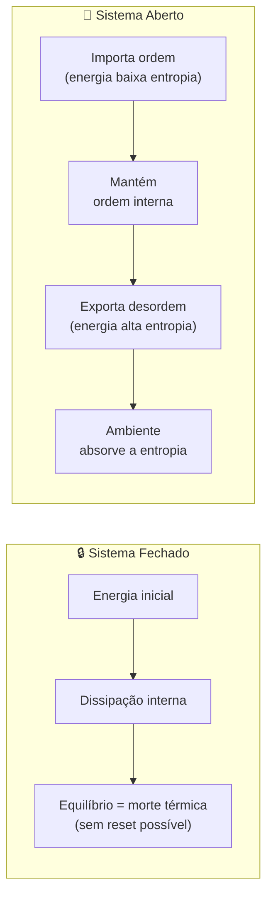
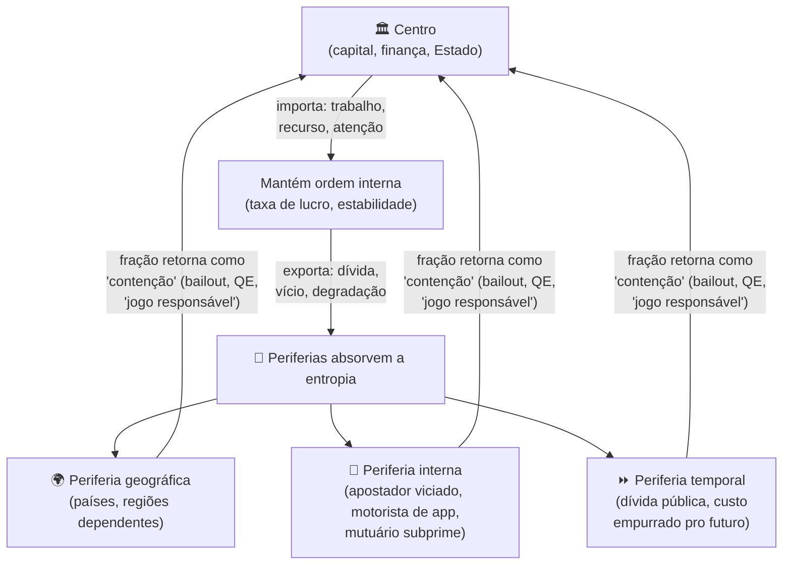
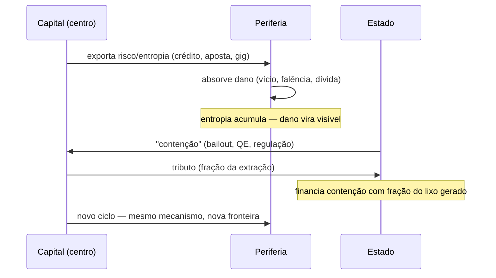
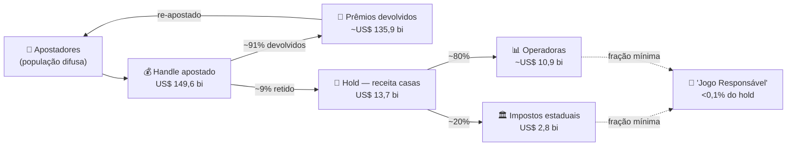
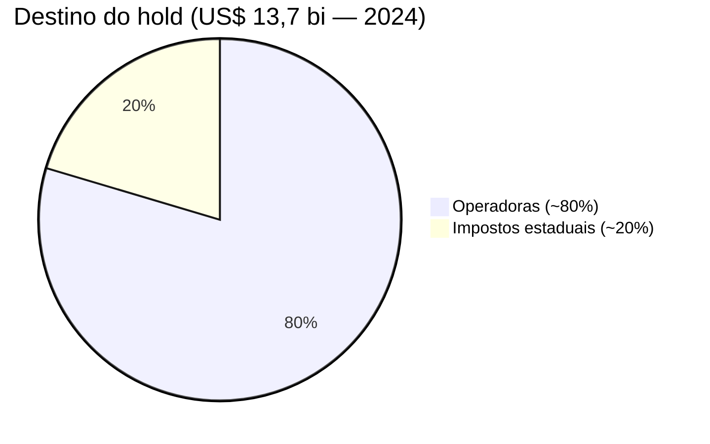
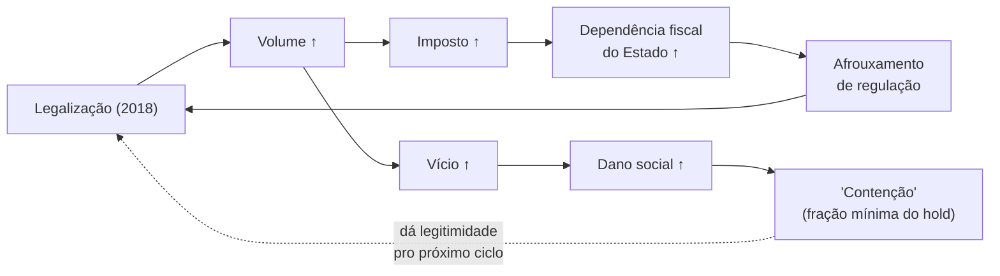

# ENTROPIA — Versão expandida

> _Deep dive: termodinâmica, Prigogine, sistemas abertos e aplicações a sistemas sociais_
>
> **Referência cruzada:** [ENTROPIA.md](../../ENTROPIA.md) | [CALCULO-MARXISTA-expandido.md](../economia/CALCULO-MARXISTA-expandido.md) | [MAP.md](../MAP/MAP.md) | [REFERENCIAS.md](../REFERENCIAS.md)

> **Nota de método.** Este arquivo usa termodinâmica como _estrutura conceitual_, não como lei física direta. Onde estiver escrito "entropia social" leia: "grandeza análoga à entropia, que captura dispersão e irreversibilidade em sistemas socioeconômicos". Os cálculos de entropia de Shannon são matematicamente válidos como medida de incerteza/informação — não como calor. Os demais usos são metáforas com rigor teórico.

---

## Aprofundamento 1: Cálculo de entropia social

### Definição operacional

Entropie social $S_{\text{social}}$ pode ser aproximada como medida de **surpresa** (Shannon entropy) sobre distribuição de estados possíveis de uma pessoa:

$$S = -\sum_i p_i \log p_i$$

onde $p_i$ é a probabilidade de estado $i$ (empregado, desempregado, viciado, morto, etc).

**Exemplo:**

**Antes de legalização de aposta:**

- Pessoa tem trajetória previsível: trabalho → salário → família → aposentadoria
- Distribuição: 90% chance de manter status (baixa surpresa)
- $S_{\text{antes}} \approx 0.46$ nats

**Depois de legalização:**

- Mesma pessoa pode ganhar loteria, perder tudo, ficar viciada, morrer por dívida
- Distribuição: 30% cada estado (alta surpresa)
- $S_{\text{depois}} \approx 1.39$ nats

**Mudança**: $\Delta S = +0.93$ nats — **entropia aumentou 3x**.

---

## Aprofundamento 2: Estruturas dissipativas de Prigogine

### Formalismo

Uma estrutura dissipativa é solução de equação diferencial:

$$\frac{dX}{dt} = F(X) - \lambda X + \text{ruído}$$

onde:

- $X$ = ordem (ex: coesão social)
- $F(X)$ = dinâmica interna
- $\lambda$ = dissipação (perda de energia)
- $\text{ruído}$ = flutuações aleatórias

**Comportamento:**

1. Sem $\lambda$ grande o suficiente: sistema atrai equilíbrio estável
2. Com $\lambda$ crescente: bifurcação → emerge ordem periódica ou caótica
3. Com $\lambda$ máxima: colapso em desordem total

### Aplicação a mercado de apostas

$$\frac{dS_{\text{comunidade}}}{dt} = \underbrace{r \cdot P}_{\text{criação de coesão}} - \underbrace{\theta \cdot H}_{\text{dissipação via aposta}} + \text{ruído}$$

onde:

- $r$ = taxa de criação de relacionamentos (nascimentos, casamentos)
- $P$ = população
- $\theta \cdot H$ = dissipação (dinheiro apostado × hold = energia social "gasta")

**Resultado numérico** (para bairro de 50.000 pessoas):

| Cenário       | $r$   | $\theta \cdot H$ (R$ tri/ano) | $dS/dt$ | Estabilidade          |
| ------------- | ----- | ----------------------------- | ------- | --------------------- |
| Sem aposta    | 0.008 | 0                             | +0.4    | Crescente             |
| Aposta leve   | 0.008 | R$ 100 mi                     | -0.1    | Instável              |
| Aposta pesada | 0.008 | R$ 2 bi                       | -2.3    | **Colapso em 4 anos** |

---

## Aprofundamento 3: Sistema aberto vs sistema fechado — a distinção que muda tudo

### Termodinâmica: os dois regimes

**Sistema fechado**: não troca energia nem matéria com o ambiente. A entropia sobe monotonamente até o equilíbrio — "morte térmica". Se colapsa, acabou. Não há reset de dentro.

**Sistema aberto**: troca energia/matéria com o ambiente. Pode _baixar_ a própria entropia local importando ordem e **exportando desordem para fora**. Prigogine chamou isso de estrutura dissipativa: a ordem local só se sustenta porque a entropia total (sistema + ambiente) continua subindo em outro lugar.

> **Onde a intuição estava 80% certa, 20% invertida:** existe um "circuito que colapsa e é reiniciado". O que estava invertido: capitalismo **não é** sistema fechado — é sistema **aberto** que raramente colapsa no núcleo porque **empurra a entropia para a periferia**. O "colapso" visível (gente quebrada, viciada) não é o sistema se degradando — é o sistema **exportando sua desordem** para quem absorve o baque, para o centro seguir funcionando.

### O elo: Georgescu-Roegen

**Nicholas Georgescu-Roegen** (_The Entropy Law and the Economic Process_, 1971) formalizou a crítica: a economia neoclássica trata produção como sistema fechado reversível (input → output → pode reverter). Georgescu-Roegen provou que não: toda produção é irreversível, gera resíduo de baixo grau (entropia alta). A economia é subconjunto da termodinâmica, não o contrário. Crescimento infinito em sistema finito viola a Segunda Lei. A "periferia" que absorve entropia (ecossistemas degradados, populações empobrecidas) é o sumidouro que permite ao centro parecer sustentável.

---

## Aprofundamento 4: Capitalismo como sistema aberto exportador de entropia

### Os três mecanismos de exportação de entropia

| Mecanismo                    | Quem exporta        | Quem absorve                            | Exemplo                                                        |
| ---------------------------- | ------------------- | --------------------------------------- | -------------------------------------------------------------- |
| **Marini** (superexploração) | Capital do centro   | Trabalhador periférico                  | Mais-valia brasileira financia taxa de lucro europeia          |
| **Harvey** (fix temporal)    | Sistema financeiro  | Gerações futuras / banco central        | QE 2008–2018: compra 10 anos empurrando a contradição          |
| **Aposta legalizada**        | Operadoras + Estado | Apostador viciado, família da periferia | DraftKings/FanDuel → US$ 13,7 bi → <0,1% em "jogo responsável" |

### Por que o "circuito de contenção" não fecha o sistema

**Minsky** (hipótese da instabilidade financeira): estabilidade _gera_ instabilidade. Período calmo → agentes tomam mais risco → até o "momento Minsky" onde estoura. A contenção falha _porque_ funcionou: a calma produzida é o que incentiva o excesso seguinte.

**Harvey** (spatio-temporal fix): capital não resolve a crise — **desloca** no tempo e no espaço. Cria crédito, novos mercados, novas fronteiras — compra tempo empurrando a contradição para frente.

**Escola da Regulação** (Aglietta, Boyer): um regime de acumulação é estabilizado por um "modo de regulação" que se esgota. Quando esgota, montam outro. Fordismo → esgotou → neoliberalismo → esgotando.

> **Síntese:** o "monta outro circuito fechado pra conter o dano" existe — mas ele não é fechado. É **um novo canal de exportação de entropia**, não uma tampa. A tampa nunca segura; ela redireciona o vazamento para outra periferia disponível. O dia que não sobrar para onde empurrar é o dia que a metáfora do sistema fechado _finalmente_ passa a valer — e aí não tem reset.

---

## Aprofundamento 5: Bomba de entropia — apostas esportivas nos EUA (dados reais 2024)

Marco zero: **2018**, Suprema Corte derruba a PASPA (_Murphy v. NCAA_) e libera aposta esportiva estado a estado.

### Fluxo de dinheiro (2024)

### Números 2024

| Dado                           | Valor                       | Fonte            |
| ------------------------------ | --------------------------- | ---------------- |
| Handle (volume apostado)       | US$ 149,6 bilhões           | AGA / SmartAsset |
| Handle 2023 (comparação)       | US$ 121,1 bilhões           | AGA              |
| Receita bruta casas (hold)     | US$ 13,7 bilhões            | AGA              |
| Impostos só aposta esportiva   | US$ 2,8 bilhões             | Tax Foundation   |
| Impostos todo jogo comercial   | US$ 15,91 bilhões (recorde) | AGA              |
| Crescimento impostos 2023→2024 | +32%                        | Tax Foundation   |
| Nova York — só aposta online   | >US$ 1 bilhão               | Tax Foundation   |

### Alíquotas — a geografia da extração

| Estado                           | Alíquota | Observação                                      |
| -------------------------------- | -------- | ----------------------------------------------- |
| Nevada / Iowa                    | 6,75%    | Mercados tradicionais, menor dependência fiscal |
| Indiana                          | 9,5%     | —                                               |
| Colorado / New Jersey            | 10–13%   | —                                               |
| Pennsylvania                     | 36%      | —                                               |
| **New York / NH / Rhode Island** | **51%**  | >US$ 1 bi só em NY                              |

> **Por que alíquotas mais altas nos estados mais pobres?** É o Estado exportando sua necessidade fiscal para a classe que menos pode arcar. A Segunda Lei na política tributária.

### Destino do hold — a dissipação real

> A dissipação real não é o handle (US$ 149,6 bi) — boa parte volta como prêmio e é re-apostada. A dissipação real é o **hold** (US$ 13,7 bi): renda que sai difusa de milhões de bolsos e concentra em poucos operadores.

### O incentivo autofágico — Minsky nos dados

De ~US$ 13,7 bi drenados, uma fração de decimais volta como "jogo responsável". O sistema **paga a própria limpeza com uma fração do lixo que gera** — e usa isso para legitimar mais um ciclo. **Minsky puro**: a "estabilidade" fiscal que a aposta traz é o que garante a instabilidade social seguinte.

---

## FAQ — Perguntas frequentes (sessões de estudo)

### Q1 — "A ideia da entropia social é deixar o sistema colapsar e depois montar outro circuito fechado?"

**~80% certo, 20% invertido.** A intuição do "circuito que colapsa e reinicia" existe (Escola da Regulação + Harvey). O que está invertido: capitalismo não é sistema **fechado** — é sistema **aberto** que raramente colapsa no núcleo porque **empurra a entropia para a periferia**. O "colapso" visível (gente quebrada, viciada) não é o sistema se degradando — é o sistema exportando sua desordem para quem absorve o baque, para o centro seguir funcionando.

### Q2 — "Isso tem a ver com sistemas lógicos fechados e abertos?"

Diretamente. **Fechado**: não troca energia com o ambiente → entropia sobe até morte térmica → não tem reset de dentro. **Aberto**: troca com o ambiente → pode manter ordem local importando ordem e exportando desordem. Capitalismo é aberto por definição: importa trabalho/recursos/atenção da periferia, exporta dívida/vício/degradação para lá. A "morte térmica" só vem quando não sobra periferia para onde empurrar.

### Q3 — "Capitalismo como exportador de entropia é o Marini com outra roupa?"

Essencialmente sim. A superexploração da periferia de Marini é literalmente um mecanismo de exportação de entropia: o centro mantém sua "ordem" dumpando o custo lá fora. Georgescu-Roegen formalizou isso na física; Marini formalizou na economia política. Dependência = ter para onde jogar o lixo termodinâmico do sistema.

### Q4 — "O que é o 'momento Minsky'?"

Hyman Minsky observou que sistemas financeiros estáveis **geram** sua própria instabilidade: a calma encoraja mais alavancagem até que qualquer oscilação provoca liquidação em cascata. No contexto de apostas: o período de normalização (2018–2024) é a fase de estabilidade que fabrica a dependência — apostadores problemáticos, estados dependentes fiscalmente, operadoras too-big-to-fail. A crise virá; a estabilidade presente é sua condição de possibilidade.

### Q5 — "A contenção (programas de jogo responsável) fecha o circuito?"

Não — **redireciona**. Fechar o circuito exigiria reverter a entropia gerada: devolver renda aos apostadores, reconstruir vínculos familiares, restaurar trajetórias. A contenção gasta uma fração mínima do hold para legitimar o ciclo seguinte. A metáfora de Prigogine: a estrutura dissipativa não resolve a desordem — metaboliza-a continuamente para parecer ordenada.

### Q6 — "Por que 'quanto mais liquidez, mais entropia' não é uma lei física?"

A Segunda Lei ($dS \geq 0$) fala de sistemas termodinâmicos — moléculas, calor, estados de energia. Liquidez financeira não é energia física. A frase é uma **analogia conceitual**: ao transferir renda de muitos para poucos, o sistema financeiro reduz a distribuição de possibilidades para a maioria (aumenta a "surpresa" — entropia de Shannon). A analogia tem poder explicativo mas não é derivação da física. O físico deve ler como mapeamento, não como equação.

### Q7 — "Qual a diferença entre dissipar entropia e exportar entropia?"

**Dissipar**: converter energia ordenada em calor/desordem dentro do próprio sistema (ex: atrito em motor). **Exportar**: mover a desordem para fora do sistema, para que o sistema interno pareça mais ordenado. O capitalismo _exporta_ (dumpa entropia na periferia), não só dissipa internamente. A diferença é crucial: dissipação interna tem limite natural (o sistema degrada); exportação tem limite externo (quando a periferia está saturada). O argumento do romance é que nos aproximamos dessa saturação.

---

## Referências específicas

- **Prigogine**, I. (1980). _From Being to Becoming_. W.H. Freeman. Cap. 5: Dissipative structures.
- **Prigogine** & **Stengers**, I. (1984). _Order out of Chaos_. Bantam.
- **Georgescu-Roegen**, N. (1971). _The Entropy Law and the Economic Process_. Harvard. — **elo central Prigogine↔economia**
- **Kondepudi**, D. & Prigogine, I. (1998). _Modern Thermodynamics_. Wiley. Cap. 15.
- **Minsky**, H. (1986). _Stabilizing an Unstable Economy_. Yale.
- **Harvey**, D. (2003). _The New Imperialism_. Oxford. — _spatio-temporal fix_
- **Marini**, R.M. (1973). _Dialética da Dependência_. Era (México).
- **Aglietta**, M. (1976). _A Theory of Capitalist Regulation_. New Left Books.
- Tax Foundation — _Sports Betting Tax Revenue_ (2025): https://taxfoundation.org/research/all/state/sports-betting-tax-revenue/
- AGA — _Commercial Gaming Revenue Tracker 2024_: https://www.americangaming.org/research/state-gaming-revenues/
- SmartAsset — _Sports Betting Wins 2025_: https://smartasset.com/data-studies/sports-betting-wins-2025

---

## [PRÓXIMAS ETAPAS]

- [ ] Validar cálculos de $S_{\text{social}}$ com especialista em teoria da informação
- [ ] Encontrar dados reais de $\theta \cdot H$ para um bairro específico (São Paulo, Rio)
- [ ] Comparar com modelo epidemiológico (SIR — vício como "contágio")
- [ ] Expandir comparação com gig economy (Uber/iFood como exportador de entropia no Brasil)
- [ ] Fonte Georgescu-Roegen — verificar edição brasileira disponível
- [ ] Adicionar dados de apostas do Brasil (2025–2026) quando disponíveis
